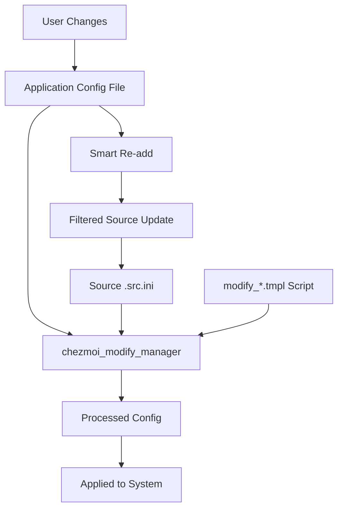

# chezmoi_modify_manager Mastery

This repository uses chezmoi_modify_manager to handle configuration files that contain a mix of settings and state. This is essential for managing applications like KDE and Nextcloud that store both user preferences and runtime state in the same files.

## Understanding the Problem

Many applications store both:
- **Settings**: User preferences that should be managed by dotfiles
- **State**: Runtime data that changes frequently and shouldn't be tracked

Examples:
- **KDE**: Window positions, recently opened files, dialog states
- **Nextcloud**: Server versions, sync paths, authentication tokens
- **Applications**: Cache data, temporary settings, session information

## File Naming Patterns

### **MUST** Follow These Conventions

- **`modify_*.tmpl`**: chezmoi_modify_manager script files
  - Example: `modify_nextcloud.cfg.tmpl`
  - Contains directives for processing INI files

- **`*.src.ini`**: Source INI files managed by chezmoi
  - Example: `private_kdeglobals.src.ini`
  - Contains only the settings we want to manage

### Directory Structure
```
private_dot_config/
├── modify_private_kdeglobals.tmpl          # Modify script
├── private_kdeglobals.src.ini              # Source settings
├── Nextcloud/
│   └── modify_nextcloud.cfg.tmpl           # Nextcloud modify script
└── private_plasma-org.kde.plasma.desktop-appletsrc.src.ini
```

## chezmoi_modify_manager Directives

### **Core Directives**

#### `source auto`
```bash
#!/usr/bin/env chezmoi_modify_manager
source auto
```
- **ALWAYS** start modify scripts with this shebang and directive
- Automatically detects and loads the corresponding `.src.ini` file

#### `ignore` - Skip Specific Keys/Sections
```bash
# Ignore specific keys in a section
ignore "General" "ColorSchemeHash"
ignore "KFileDialog Settings" "Show hidden files"

# Ignore entire sections
ignore section "DirSelect Dialog"
ignore section "Settings"

# Ignore keys matching regex patterns
ignore regex "General" "clientVersion|desktopEnterpriseChannel|isVfsEnabled"
ignore regex "Accounts" ".*version|.*journalPath|.*server.*|.*networkProxy.*"
```

#### `set` - Force Specific Values
```bash
# Set specific values (useful with templates)
set "Accounts" "0\\Folders\\1\\localPath" "/home/{{ .firstname | lower }}/Synchronized/"
set "Accounts" "0\\dav_user" "{{ .firstname | lower }}"
set "Accounts" "0\\displayName" "{{ .firstname }}"

# Template variable usage
{{ $nextcloudServer := .privateServer | replace "www" "nextcloud" }}
set "Accounts" "0\\url" "{{ $nextcloudServer }}"
```

#### `add:remove` and `add:hide` - Control What Gets Added Back
```bash
# Remove from source when re-adding (since we set it dynamically)
add:remove "Accounts" "0\\Folders\\1\\localPath"
add:remove "Accounts" "0\\dav_user"
add:remove "Accounts" "0\\displayName"
add:remove "Accounts" "0\\url"

# Hide sensitive values when adding back to source
add:hide "Accounts" "0\\password"
```

## Template Integration Patterns

### **MUST** Use Template Variables in Modify Scripts

#### Variable Access
```bash
# Access chezmoi template variables
set "User" "Name" "{{ .fullname }}"
set "User" "Email" "{{ .personalEmail }}"
set "Paths" "Home" "/home/{{ .firstname | lower }}"

# String transformations
{{ $nextcloudServer := .privateServer | replace "www" "nextcloud" }}
set "Server" "URL" "{{ $nextcloudServer }}"
```

#### Conditional Logic
```bash
{{ if eq .chassisType "laptop" }}
set "Power" "SuspendOnLidClose" "true"
{{ else }}
set "Power" "SuspendOnLidClose" "false"
{{ end }}
```

## Common Patterns by Application

### KDE Configuration
```bash
#!/usr/bin/env chezmoi_modify_manager
source auto

# Ignore dynamic state
ignore "General" "ColorSchemeHash"
ignore "KFileDialog Settings" "Show hidden files"
ignore "KFileDialog Settings" "Show Inline Previews"
ignore section "DirSelect Dialog"

# Set user preferences
set "General" "Name" "{{ .fullname }}"
```

### Nextcloud Configuration
```bash
#!/usr/bin/env chezmoi_modify_manager
source auto

# Ignore runtime state
ignore regex "General" "clientVersion|desktopEnterpriseChannel|isVfsEnabled"
ignore regex "Accounts" ".*version|.*journalPath|.*server.*|.*networkProxy.*"
ignore section "Settings"

# Set user-specific values
set "Accounts" "0\\Folders\\1\\localPath" "/home/{{ .firstname | lower }}/Synchronized/"
set "Accounts" "0\\dav_user" "{{ .firstname | lower }}"
set "Accounts" "0\\displayName" "{{ .firstname }}"

# Template server URL
{{ $nextcloudServer := .privateServer | replace "www" "nextcloud" }}
set "Accounts" "0\\url" "{{ $nextcloudServer }}"

# Remove from source since we set them dynamically
add:remove "Accounts" "0\\Folders\\1\\localPath"
add:remove "Accounts" "0\\dav_user"
add:remove "Accounts" "0\\displayName"
add:remove "Accounts" "0\\url"
```

## Workflow Understanding

### **MUST** Understand the Process Flow



### File Processing Steps
1. **Read** the current application config file
2. **Load** the source `.src.ini` file (our managed settings)
3. **Apply** the modify script directives
4. **Merge** settings with current state
5. **Write** the processed configuration

### Smart Re-adding
```bash
# Re-add files with filtering
chezmoi_modify_manager add path/to/config.ini

# Convert existing files to managed
chezmoi_modify_manager convert path/to/config.ini
```

## Error Handling Patterns

### **MUST** Include Proper Error Handling

```bash
#!/usr/bin/env chezmoi_modify_manager

# Validate template variables
{{ if not .firstname }}
# ERROR: firstname variable not set
{{ end }}

source auto

# Safe key access with fallbacks
{{ $server := .privateServer | default "localhost" }}
set "Server" "URL" "{{ $server }}"
```

## Integration with chezmoi Scripts

### **SHOULD** Process in Correct Order

```bash
# In chezmoi scripts, process modify files after applying
{{ if eq .osId "linux-arch" }}
    # Apply chezmoi first
    chezmoi apply
    
    # Then process modify scripts
    find ~/.config -name "*.cfg" -exec chezmoi_modify_manager {} \;
{{ end }}
```

## Advanced Patterns

### Complex State Separation
```bash
#!/usr/bin/env chezmoi_modify_manager
source auto

# Ignore all dynamic sections
ignore section "RecentFiles"
ignore section "WindowState"
ignore section "DialogState"

# Ignore version-specific keys
ignore regex ".*" ".*Version|.*Build|.*Hash"

# Set consistent user preferences
set "Appearance" "Theme" "{{ .colors.oksolar.base03 }}"
set "Behavior" "AutoSave" "true"
```

### Multi-User Configurations
```bash
#!/usr/bin/env chezmoi_modify_manager
source auto

# User-specific paths
set "Paths" "Documents" "/home/{{ .firstname | lower }}/Documents"
set "Paths" "Downloads" "/home/{{ .firstname | lower }}/Downloads"

# Email-based configurations
{{ if eq .workEmail "" }}
set "Profile" "Type" "Personal"
{{ else }}
set "Profile" "Type" "Work"
set "Profile" "Email" "{{ .workEmail }}"
{{ end }}
```

## Debugging and Troubleshooting

### **SHOULD** Use These Debugging Techniques

```bash
# Test modify scripts
chezmoi_modify_manager --dry-run modify_script.tmpl

# Validate INI syntax
chezmoi_modify_manager validate config.ini

# Check what would be ignored
chezmoi_modify_manager diff original.ini processed.ini
```

### Common Issues
1. **Incorrect escaping**: Use `\\` for Windows-style paths in INI keys
2. **Missing source files**: Ensure `.src.ini` exists and is properly formatted
3. **Template errors**: Validate template syntax before applying
4. **Permission issues**: Ensure modify scripts are executable

## Best Practices

### **MUST** Follow These Guidelines

1. ✅ **Always use `source auto`** at the beginning of modify scripts
2. ✅ **Ignore all state-related keys** to prevent churn
3. ✅ **Use templates for user-specific values** 
4. ✅ **Document why specific keys are ignored**
5. ✅ **Test modify scripts before applying**

### **SHOULD** Consider These Practices

1. ✅ **Group related ignore statements** for readability
2. ✅ **Use regex patterns** for complex ignore rules
3. ✅ **Add comments** explaining complex logic
4. ✅ **Use `add:remove`** for dynamically set values
5. ✅ **Validate template variables** before use

### **NEVER** Do These Things

1. ❌ **Never track state data** in source files
2. ❌ **Never ignore security-critical settings**
3. ❌ **Never modify encrypted files** without proper handling
4. ❌ **Never assume INI format** without validation
5. ❌ **Never skip testing** modify scripts

## Verification Checklist

Before creating or modifying chezmoi_modify_manager files:

<thinking>
1. Does this file contain both settings and state?
2. Have I identified which keys are state vs settings?
3. Are my ignore patterns comprehensive?
4. Do I need template variables for user-specific values?
5. Have I tested the modify script?
</thinking>

### Critical Questions
1. 🔍 **What data should be managed vs ignored?**
2. 🔍 **Are template variables properly validated?**
3. 🔍 **Will this work across different machines?**
4. 🔍 **Have I documented the reasoning for ignore patterns?**

---

**REMEMBER**: chezmoi_modify_manager is powerful but requires careful consideration of what should be managed vs what should remain as local state.
