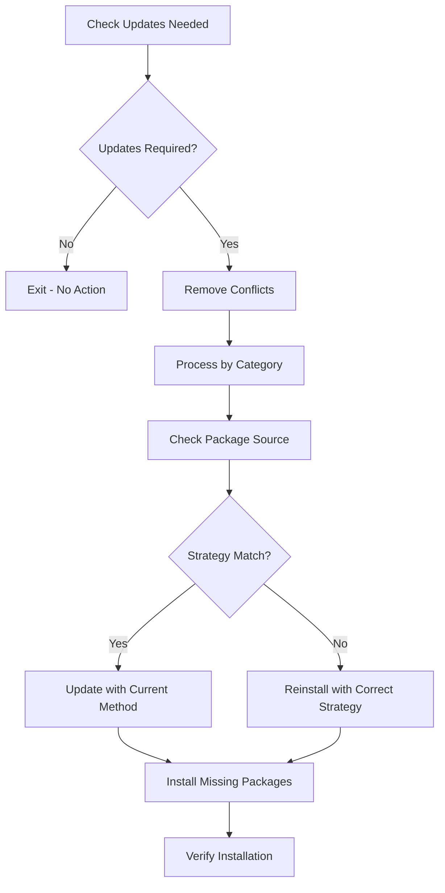

# Arch Linux Package Management System

This repository implements a sophisticated package management system for Arch Linux with multi-strategy installation, complex dependency resolution, and hash-based change detection.

## Package Management Philosophy

### **MUST** Understand the Strategy System

The package management uses a three-tier strategy approach:
1. **`pacman`**: Official repositories (fastest, most reliable)
2. **`yay_bin`**: AUR binary packages (pre-compiled)
3. **`yay_source`**: AUR source packages (compiled locally)

### Strategy Selection Logic
```yaml
# .chezmoidata/packages.yaml
strategies:
  default_strategy: [pacman, yay_bin, yay_source]
  _install_binary: &_install_binary [pacman, yay_bin]
  _install_from_source: &_install_from_source [pacman, yay_bin, yay_source]
```

## Package Categories Understanding

### **MUST** Respect Package Categorization

```yaml
packages:
  install:
    arch:
      packages:
        fonts:                    # System fonts
        terminal_essentials:      # Core CLI tools
        terminal_utils:          # Additional utilities
        terminal_presentation:   # Presentation tools
        languages:               # Programming languages
        package_managers:        # Additional package managers
        development_tools:       # Development software
        development_clis:        # Development CLI tools
        system_software:         # System-level software
        general_software:        # User applications
        ai_tools:               # AI/ML tools
```

### Category-Specific Strategies
- **Fonts**: Default strategy (prefer official repos)
- **Terminal essentials**: From source (latest features)
- **General software**: Binary only (stability over features)
- **AI tools**: From source (cutting-edge versions)

## Installation Flow Understanding

### **MUST** Follow the Installation Process



### Package Source Detection
```bash
get_package_source() {
    local package="$1"
    
    # Check official repos first
    if pacman -Qi "$package" >/dev/null 2>&1; then
        local repo=$(pacman -Qi "$package" | grep "Repository" | awk '{print $3}')
        if [ "$repo" != "aur" ]; then
            echo "pacman"
            return 0
        fi
    fi
    
    # Check AUR packages
    if yay -Qi "$package" >/dev/null 2>&1; then
        # Heuristic: check for build files
        if [ -d "/home/$USER/.cache/yay/$package" ]; then
            echo "yay_source"
        else
            echo "yay_bin"
        fi
        return 0
    fi
    
    echo "not_installed"
}
```

## Hash-Based Change Detection

### **MUST** Understand run_onchange Scripts

The package update script uses hash-based detection:
```bash
# Generate hash for chezmoi run_onchange detection
# Hash: {{ include ".chezmoidata/packages.yaml" | sha256sum }}{{ range $name, $config := .packages.install.arch.packages }}{{ range $config.list }}{{ . }}{{ end }}{{ end }}
```

### Hash Components
1. **packages.yaml content**: Detects configuration changes
2. **Package list iteration**: Detects package additions/removals
3. **Combined hash**: Triggers script when either changes

## Strategy Resolution Logic

### **MUST** Follow Strategy Priority

```bash
get_update_method() {
    local package="$1"
    local strategy="$2"
    local current_source="$3"
    
    # New package: use first strategy method
    if [ "$current_source" = "not_installed" ]; then
        echo "$strategy" | awk '{print $1}'
        return 0
    fi
    
    # Prefer pacman for official packages
    if is_package_in_official_repos "$package"; then
        if echo "$strategy" | grep -q "pacman"; then
            echo "pacman"
            return 0
        fi
    fi
    
    # AUR packages: prefer binary over source
    if echo "$strategy" | grep -q "yay_bin"; then
        echo "yay_bin"
    elif echo "$strategy" | grep -q "yay_source"; then
        echo "yay_source"
    else
        echo "$strategy" | awk '{print $1}'
    fi
}
```

## Error Handling and Validation

### **MUST** Include Comprehensive Error Handling

```bash
# OS Validation (CRITICAL)
{{ if eq .osId "linux-arch" }}
    # Implementation
{{ else }}
    echo "ERROR: This script is only supported on Arch Linux systems"
    echo "Required: osId 'linux-arch'"
    echo "Detected: '{{ .osId }}'"
    echo "Script: $(basename "$0")"
    exit 1
{{ end }}

# Package availability check
is_package_in_official_repos() {
    local package="$1"
    pacman -Si "$package" >/dev/null 2>&1
}

# Installation verification
is_package_installed() {
    local package="$1"
    pacman -Qi "$package" >/dev/null 2>&1 || yay -Qi "$package" >/dev/null 2>&1
}
```

## Installation Functions

### **MUST** Use Correct Installation Methods

```bash
# Official repository packages
install_with_pacman() {
    sudo pacman -S --noconfirm --needed "$@"
}

update_with_pacman() {
    sudo pacman -Syu --noconfirm --needed "$@"
}

# AUR binary packages
install_with_yay_bin() {
    yay -S --noconfirm --needed --norebuild --redownload "$@"
}

update_with_yay_bin() {
    yay -Syu --noconfirm --needed --norebuild --redownload "$@"
}

# AUR source packages
install_with_yay_source() {
    yay -S --noconfirm --needed --rebuild "$@"
}

update_with_yay_source() {
    yay -Syu --noconfirm --needed --rebuild "$@"
}
```

## Conflict Resolution

### **MUST** Handle Package Conflicts

```bash
# Remove conflicting packages first
echo "Removing conflicting packages..."
yay -R --noconfirm {{ .packages.delete.arch }} 2>/dev/null || true

# Reinstall with correct strategy
reinstall_package() {
    local package="$1"
    local strategy="$2"
    
    echo "Reinstalling $package with strategy: $strategy"
    
    # Remove first
    if is_package_installed "$package"; then
        echo "Removing $package..."
        yay -R --noconfirm "$package" || sudo pacman -R --noconfirm "$package"
    fi
    
    # Install with correct strategy
    for installer in $strategy; do
        if install_with_$installer "$package"; then
            echo "✓ Successfully reinstalled $package with $installer"
            return 0
        fi
    done
    
    echo "✗ Failed to reinstall $package with any method in strategy"
    return 1
}
```

## Template Integration Patterns

### **MUST** Use Template Variables Correctly

```bash
# Iterate over package categories
{{ range $name, $config := .packages.install.arch.packages -}}
    {{- $strategy := $.packages.install.arch.strategies.default_strategy -}}
    {{- if hasKey $config "strategy" -}}
        {{- $strategy = $config.strategy -}}
    {{- end -}}
    {{- $packages := $config.list -}}
    
    {{- if $packages }}
echo "Processing {{ $name }} packages..."

# Check each package in category
        {{- range $packages }}
current_source=$(get_package_source "{{ . }}")
intended_strategy="{{ join " " $strategy }}"
        {{- end }}
    {{- end }}
{{ end -}}
```

## Performance Optimization

### **SHOULD** Implement Quick Checks

```bash
check_updates_needed() {
    echo "Checking for package updates and strategy compliance..."
    
    # Quick system update check
    if ! pacman -Qu >/dev/null 2>&1 && ! yay -Qu >/dev/null 2>&1; then
        echo "No system updates available"
    else
        echo "System updates available"
        return 0
    fi
    
    # Strategy compliance check
    local needs_action=false
    # ... check each package for strategy compliance
    
    if [ "$needs_action" = "true" ]; then
        echo "Package management actions needed"
        return 0
    else
        echo "All packages are up to date and strategy compliant"
        return 1
    fi
}
```

## Best Practices

### **MUST** Follow These Guidelines

1. ✅ **Always validate OS compatibility** before running package operations
2. ✅ **Use strategy fallbacks** for robust installation
3. ✅ **Check package sources** before updating
4. ✅ **Handle conflicts gracefully** with proper removal
5. ✅ **Verify installations** after completion

### **SHOULD** Consider These Practices

1. ✅ **Group packages by update method** for efficiency
2. ✅ **Use quick checks** to avoid unnecessary work
3. ✅ **Log installation progress** for debugging
4. ✅ **Implement retry logic** for network failures
5. ✅ **Cache package information** when possible

### **NEVER** Do These Things

1. ❌ **Never run package operations on non-Arch systems**
2. ❌ **Never ignore strategy preferences**
3. ❌ **Never force installations without checking conflicts**
4. ❌ **Never skip verification steps**
5. ❌ **Never assume package availability**

## Debugging and Troubleshooting

### **SHOULD** Use These Debugging Techniques

```bash
# Debug package source detection
echo "Package: $package"
echo "Current source: $(get_package_source "$package")"
echo "Intended strategy: $strategy"
echo "Update method: $(get_update_method "$package" "$strategy" "$(get_package_source "$package")")"

# Test strategy compliance
for pkg in $packages_to_check; do
    current_source=$(get_package_source "$pkg")
    echo "$pkg: $current_source (expected: $expected_strategy)"
done
```

## Verification Checklist

Before modifying package management scripts:

<thinking>
1. Is this script running on Arch Linux?
2. Are the package strategies appropriate for the category?
3. Have I tested the installation methods?
4. Are conflicts properly handled?
5. Is the hash-based detection working correctly?
</thinking>

### Critical Questions
1. 🔍 **Will this work on the target Arch system?**
2. 🔍 **Are the package strategies optimal?**
3. 🔍 **Have I handled all error cases?**
4. 🔍 **Is the change detection working properly?**

---

**REMEMBER**: This package management system is designed for reliability and consistency across multiple Arch Linux machines. Always test changes carefully and respect the strategy hierarchy.
