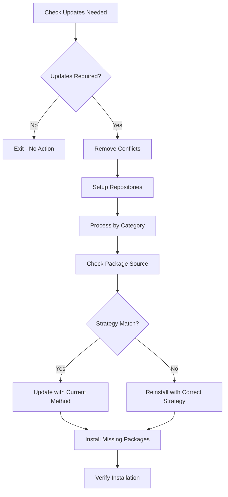

# Linux Package Management System

This repository implements a sophisticated package management system for Linux distributions with multi-strategy installation, complex dependency resolution, cross-distribution compatibility, and hash-based change detection. Currently supports Arch Linux and Fedora-based distributions.

## Multi-Distribution Architecture

### **Distribution Detection System**

The system uses enhanced OS detection in `.chezmoi.yaml.tmpl`:

```go
{{- $osid := .chezmoi.os -}}
{{- if hasKey .chezmoi.osRelease "id" -}}
{{-   if eq .chezmoi.osRelease.id "arch" -}}
{{-     $osid = "linux-arch" -}}
{{-   else if eq .chezmoi.osRelease.id "fedora" -}}
{{-     $osid = "linux-fedora" -}}
{{-   else if eq .chezmoi.osRelease.id "centos" -}}
{{-     $osid = "linux-fedora" -}}
{{-   else if eq .chezmoi.osRelease.id "rhel" -}}
{{-     $osid = "linux-fedora" -}}
{{-   else if hasKey .chezmoi.osRelease "idLike" -}}
{{-     $osid = printf "%s-%s" .chezmoi.os .chezmoi.osRelease.idLike -}}
{{-   else -}}
{{-     $osid = printf "%s-%s" .chezmoi.os .chezmoi.osRelease.id -}}
{{-   end -}}
{{- end -}}
```

### **Distribution-Specific Package Management Strategies**

Each distribution has its own three-tier package management strategy:

- **Arch Linux**: `pacman` → `yay_bin` → `yay_source`
- **Fedora**: `dnf` → `copr` → `flatpak`

## Package Management Philosophy

### **MUST** Understand the Strategy System

Both distributions use a three-tier strategy approach with different implementations:

#### Arch Linux Strategy
1. **`pacman`**: Official repositories (fastest, most reliable)
2. **`yay_bin`**: AUR binary packages (pre-compiled)
3. **`yay_source`**: AUR source packages (compiled locally)

#### Fedora Strategy
1. **`dnf`**: Official Fedora repositories (fastest, most reliable)
2. **`copr`**: Community Projects (COPR repositories)
3. **`flatpak`**: Universal packages (Flathub)

### Strategy Configuration
```yaml
# .chezmoidata/packages.yaml
packages:
  install:
    arch:
      strategies:
        default_strategy: [pacman, yay_bin, yay_source]
        _install_binary: &_install_binary [pacman, yay_bin]
        _install_from_source: &_install_from_source [pacman, yay_bin, yay_source]
    
    fedora:
      strategies:
        default_strategy: [dnf, copr, flatpak]
        _install_official: &_install_official [dnf]
        _install_community: &_install_community [dnf, copr]
        _install_universal: &_install_universal [dnf, copr, flatpak]
```

## Package Categories Understanding

### **MUST** Respect Package Categorization

```yaml
packages:
  install:
    arch:
      packages:
        fonts:                    # System fonts
        terminal_essentials:      # Core CLI tools
        terminal_utils:          # Additional utilities
        terminal_presentation:   # Presentation tools
        languages:               # Programming languages
        package_managers:        # Additional package managers
        development_tools:       # Development software
        development_clis:        # Development CLI tools
        system_software:         # System-level software
        general_software:        # User applications
        ai_tools:               # AI/ML tools
    
    fedora:
      packages:
        # Same categories with distribution-specific package names
```

### Category-Specific Strategies

#### Arch Linux
- **Fonts**: Default strategy (prefer official repos)
- **Terminal essentials**: From source (latest features)
- **General software**: Binary only (stability over features)
- **AI tools**: From source (cutting-edge versions)

#### Fedora
- **Fonts**: Official repositories
- **Terminal essentials**: Community repositories (COPR)
- **Development tools**: Universal strategy (dnf → copr → flatpak)
- **AI tools**: Community repositories

## Cross-Distribution Package Mapping

### **MUST** Handle Cross-Distribution Package Names

The system includes a comprehensive package mapping structure:

```yaml
mapping:
  # Terminal essentials
  fd:
    arch: fd
    fedora: fd-find
  tlrc:
    arch: tlrc
    fedora: tldr
  jaq:
    arch: jaq
    fedora: jq
  
  # Languages
  go:
    arch: go
    fedora: golang
  python:
    arch: python
    fedora: python3
  
  # Development tools
  docker:
    arch: docker
    fedora: docker-ce
  docker-compose:
    arch: docker-compose
    fedora: docker-compose-plugin
```

### **SHOULD** Use Mapping for New Packages

When adding new packages, always consider cross-distribution compatibility:

1. ✅ **Check package names** across distributions
2. ✅ **Add mapping entries** for different names
3. ✅ **Test availability** in target repositories
4. ✅ **Provide fallback strategies** when packages don't exist

## Installation Flow Understanding

### **MUST** Follow the Installation Process



## Distribution-Specific Implementation

### Arch Linux Implementation

#### Package Source Detection
```bash
get_package_source() {
    local package="$1"
    
    # Check official repos first
    if pacman -Qi "$package" >/dev/null 2>&1; then
        local repo=$(pacman -Qi "$package" | grep "Repository" | awk '{print $3}')
        if [ "$repo" != "aur" ]; then
            echo "pacman"
            return 0
        fi
    fi
    
    # Check AUR packages
    if yay -Qi "$package" >/dev/null 2>&1; then
        # Heuristic: check for build files
        if [ -d "/home/$USER/.cache/yay/$package" ]; then
            echo "yay_source"
        else
            echo "yay_bin"
        fi
        return 0
    fi
    
    echo "not_installed"
}
```

#### Installation Functions
```bash
# Official repository packages
install_with_pacman() {
    sudo pacman -S --noconfirm --needed "$@"
}

update_with_pacman() {
    sudo pacman -Syu --noconfirm --needed "$@"
}

# AUR binary packages
install_with_yay_bin() {
    yay -S --noconfirm --needed --norebuild --redownload "$@"
}

update_with_yay_bin() {
    yay -Syu --noconfirm --needed --norebuild --redownload "$@"
}

# AUR source packages
install_with_yay_source() {
    yay -S --noconfirm --needed --rebuild "$@"
}

update_with_yay_source() {
    yay -Syu --noconfirm --needed --rebuild "$@"
}
```

### Fedora Implementation

#### Repository Management
```bash
# Enable RPM Fusion repositories
enable_rpmfusion() {
    echo "Enabling RPM Fusion repositories..."
    
    # Enable RPM Fusion Free
    if ! rpm -q rpmfusion-free-release >/dev/null 2>&1; then
        sudo dnf install -y "https://mirrors.rpmfusion.org/free/fedora/rpmfusion-free-release-$(rpm -E %fedora).noarch.rpm"
    fi
    
    # Enable RPM Fusion Non-Free
    if ! rpm -q rpmfusion-nonfree-release >/dev/null 2>&1; then
        sudo dnf install -y "https://mirrors.rpmfusion.org/nonfree/fedora/rpmfusion-nonfree-release-$(rpm -E %fedora).noarch.rpm"
    fi
}

# Enable COPR repository
enable_copr_repo() {
    local repo="$1"
    echo "Enabling COPR repository: $repo"
    sudo dnf copr enable -y "$repo"
}

# Enable Flathub
enable_flathub() {
    if command -v flatpak >/dev/null 2>&1; then
        echo "Enabling Flathub repository..."
        flatpak remote-add --if-not-exists flathub https://flathub.org/repo/flathub.flatpakrepo
    fi
}
```

#### Package Source Detection
```bash
get_package_source() {
    local package="$1"
    
    # Check if package is installed via dnf (official repos or COPR)
    if rpm -q "$package" >/dev/null 2>&1; then
        # Check if it's from a COPR repository
        local repo=$(dnf info installed "$package" 2>/dev/null | grep "From repo" | awk '{print $4}')
        if echo "$repo" | grep -q "copr"; then
            echo "copr"
        else
            echo "dnf"
        fi
        return 0
    fi
    
    # Check if package is installed via flatpak
    if command -v flatpak >/dev/null 2>&1 && flatpak list | grep -q "$package"; then
        echo "flatpak"
        return 0
    fi
    
    # Package not installed
    echo "not_installed"
    return 1
}
```

#### Installation Functions
```bash
# DNF (Official Repositories)
install_with_dnf() {
    sudo dnf install -y "$@"
}

update_with_dnf() {
    sudo dnf update -y "$@"
}

# COPR (Community Repositories)
install_with_copr() {
    # COPR packages are installed via dnf after enabling the repo
    sudo dnf install -y "$@"
}

update_with_copr() {
    # COPR packages are updated via dnf
    sudo dnf update -y "$@"
}

# Flatpak (Universal Packages)
install_with_flatpak() {
    if command -v flatpak >/dev/null 2>&1; then
        flatpak install -y flathub "$@"
    else
        echo "Flatpak not available for installing $@"
        return 1
    fi
}

update_with_flatpak() {
    if command -v flatpak >/dev/null 2>&1; then
        flatpak update -y "$@"
    else
        echo "Flatpak not available for updating $@"
        return 1
    fi
}
```

## Hash-Based Change Detection

### **MUST** Understand run_onchange Scripts

The package update scripts use hash-based detection:

#### Arch Linux
```bash
# Generate hash for chezmoi run_onchange detection
# Hash: {{ include ".chezmoidata/packages.yaml" | sha256sum }}{{ range $name, $config := .packages.install.arch.packages }}{{ range $config.list }}{{ . }}{{ end }}{{ end }}
```

#### Fedora
```bash
# Generate hash for chezmoi run_onchange detection
# Hash: {{ include ".chezmoidata/packages.yaml" | sha256sum }}{{ range $name, $config := .packages.install.fedora.packages }}{{ range $config.list }}{{ . }}{{ end }}{{ end }}
```

### Hash Components
1. **packages.yaml content**: Detects configuration changes
2. **Package list iteration**: Detects package additions/removals
3. **Combined hash**: Triggers script when either changes

## Strategy Resolution Logic

### **MUST** Follow Strategy Priority

#### Universal Strategy Resolution
```bash
get_update_method() {
    local package="$1"
    local strategy="$2"
    local current_source="$3"
    
    # New package: use first strategy method
    if [ "$current_source" = "not_installed" ]; then
        echo "$strategy" | awk '{print $1}'
        return 0
    fi
    
    # Prefer official repositories for both distributions
    if is_package_in_official_repos "$package"; then
        if echo "$strategy" | grep -q -E "(pacman|dnf)"; then
            echo "$strategy" | grep -o -E "(pacman|dnf)" | head -1
            return 0
        fi
    fi
    
    # Distribution-specific fallback logic
    # Implementation varies by distribution
}
```

## Error Handling and Validation

### **MUST** Include Comprehensive Error Handling

#### Distribution Validation Pattern
```bash
{{ if eq .chezmoi.os "linux" }}
    {{ if or (eq .chezmoi.osRelease.id "arch") (eq .chezmoi.osRelease.id "endeavouros") }}
        # Arch-specific implementation
    {{ else if or (eq .chezmoi.osRelease.id "fedora") (eq .chezmoi.osRelease.id "centos") }}
        # Fedora-specific implementation
    {{ else }}
        echo "ERROR: This script is only supported on Arch or Fedora-based systems"
        echo "Required: Arch Linux, EndeavourOS, Fedora, CentOS Stream, or RHEL"
        echo "Detected: '{{ .chezmoi.osRelease.id }}'"
        echo "Script: $(basename "$0")"
        exit 1
    {{ end }}
{{ else }}
    echo "ERROR: This script is only supported on Linux systems"
    echo "Required: Linux"
    echo "Detected: '{{ .chezmoi.os }}'"
    echo "Script: $(basename "$0")"
    exit 1
{{ end }}
```

#### Package Availability Checks

##### Arch Linux
```bash
# Check if package is available in official repos
is_package_in_official_repos() {
    local package="$1"
    pacman -Si "$package" >/dev/null 2>&1
}

# Installation verification
is_package_installed() {
    local package="$1"
    pacman -Qi "$package" >/dev/null 2>&1 || yay -Qi "$package" >/dev/null 2>&1
}
```

##### Fedora
```bash
# Check if package is available in official repos
is_package_in_official_repos() {
    local package="$1"
    dnf info "$package" >/dev/null 2>&1
}

# Check if package is available in COPR
is_package_in_copr() {
    local package="$1"
    dnf search "$package" --enablerepo="*copr*" >/dev/null 2>&1
}

# Check if package is available as flatpak
is_package_in_flatpak() {
    local package="$1"
    command -v flatpak >/dev/null 2>&1 && flatpak search "$package" >/dev/null 2>&1
}

# Installation verification
is_package_installed() {
    local package="$1"
    rpm -q "$package" >/dev/null 2>&1 || (command -v flatpak >/dev/null 2>&1 && flatpak list | grep -q "$package")
}
```

## Conflict Resolution

### **MUST** Handle Package Conflicts

#### Universal Conflict Resolution Pattern
```bash
# Remove conflicting packages first
echo "Removing conflicting packages..."
# Distribution-specific removal commands

# Reinstall with correct strategy
reinstall_package() {
    local package="$1"
    local strategy="$2"
    
    echo "Reinstalling $package with strategy: $strategy"
    
    # Remove first (distribution-specific)
    if is_package_installed "$package"; then
        echo "Removing $package..."
        # Distribution-specific removal
    fi
    
    # Install with correct strategy
    for installer in $strategy; do
        if install_with_$installer "$package"; then
            echo "✓ Successfully reinstalled $package with $installer"
            return 0
        fi
    done
    
    echo "✗ Failed to reinstall $package with any method in strategy"
    return 1
}
```

## Template Integration Patterns

### **MUST** Use Template Variables Correctly

#### Universal Template Pattern
```bash
# Iterate over package categories (distribution-agnostic)
{{ range $name, $config := .packages.install.DISTRIBUTION.packages -}}
    {{- $strategy := $.packages.install.DISTRIBUTION.strategies.default_strategy -}}
    {{- if hasKey $config "strategy" -}}
        {{- $strategy = $config.strategy -}}
    {{- end -}}
    {{- $packages := $config.list -}}
    
    {{- if $packages }}
echo "Processing {{ $name }} packages..."

# Check each package in category
        {{- range $packages }}
current_source=$(get_package_source "{{ . }}")
intended_strategy="{{ join " " $strategy }}"
        {{- end }}
    {{- end }}
{{ end -}}
```

### **MUST** Respect Destination Filtering

```bash
{{- $destinationConfig := index .destinations .destination -}}

# Check if category is enabled for destination
{{ if has $name $destinationConfig.packages }}
    echo "Processing {{ $name }} category (enabled for {{ $.destination }} destination)"
    # Implementation
{{ else }}
    echo "Skipping {{ $name }} category (not configured for {{ $.destination }} destination)"
{{ end }}
```

## Performance Optimization

### **SHOULD** Implement Quick Checks

#### Universal Quick Check Pattern
```bash
check_updates_needed() {
    echo "Checking for package updates and strategy compliance for {{ .destination }} destination..."
    
    # Distribution-specific system update check
    # Arch: pacman -Qu && yay -Qu
    # Fedora: dnf check-update
    
    # Strategy compliance check (universal)
    local needs_action=false
    # ... check each package for strategy compliance
    
    if [ "$needs_action" = "true" ]; then
        echo "Package management actions needed"
        return 0
    else
        echo "All packages are up to date and strategy compliant"
        return 1
    fi
}
```

## Testing and Validation

### **SHOULD** Test on Multiple Distribution Variants

#### Arch Linux
1. **Arch Linux**: Primary rolling release
2. **EndeavourOS**: Arch-based user-friendly distribution

#### Fedora
1. **Fedora Workstation**: Primary desktop distribution
2. **CentOS Stream**: Enterprise-focused distribution
3. **RHEL**: Enterprise Linux (if available)

## Best Practices

### **MUST** Follow These Guidelines

1. ✅ **Always validate distribution compatibility** before running package operations
2. ✅ **Use strategy fallbacks** for robust installation
3. ✅ **Check package sources** before updating
4. ✅ **Handle repository setup** gracefully (Fedora)
5. ✅ **Handle conflicts gracefully** with proper removal
6. ✅ **Verify installations** after completion

### **SHOULD** Consider These Practices

1. ✅ **Group packages by update method** for efficiency
2. ✅ **Use quick checks** to avoid unnecessary work
3. ✅ **Log installation progress** for debugging
4. ✅ **Implement retry logic** for network failures
5. ✅ **Cache package information** when possible

### **NEVER** Do These Things

1. ❌ **Never run package operations on unsupported distributions**
2. ❌ **Never ignore strategy preferences**
3. ❌ **Never force installations without checking conflicts**
4. ❌ **Never skip repository setup** (Fedora)
5. ❌ **Never skip verification steps**
6. ❌ **Never assume package availability**

## Troubleshooting Common Issues

### Arch Linux Issues
```bash
# Update package databases
sudo pacman -Sy

# Check for partial upgrades
sudo pacman -Syu

# Clear package cache
sudo pacman -Sc

# Rebuild AUR packages
yay -S --rebuild package-name
```

### Fedora Issues
```bash
# Refresh repository metadata
sudo dnf makecache

# Check repository status
dnf repolist

# Enable specific repository
sudo dnf config-manager --enable repository-name

# Check for conflicts
dnf check

# Resolve conflicts
sudo dnf distro-sync

# Flatpak issues
flatpak --version
flatpak update
```

## Debugging and Troubleshooting

### **SHOULD** Use These Debugging Techniques

```bash
# Debug package source detection (universal)
echo "Package: $package"
echo "Current source: $(get_package_source "$package")"
echo "Intended strategy: $strategy"
echo "Update method: $(get_update_method "$package" "$strategy" "$(get_package_source "$package")")"

# Test strategy compliance (universal)
for pkg in $packages_to_check; do
    current_source=$(get_package_source "$pkg")
    echo "$pkg: $current_source (expected: $expected_strategy)"
done
```

## Integration with Existing System

### **MUST** Maintain Cross-Distribution Compatibility

- Both distribution implementations use the same template patterns
- Destination-based filtering works across all distributions
- Error handling follows established patterns
- Package categorization is consistent

### **SHOULD** Follow Established Patterns

1. ✅ **Use same script naming conventions**
2. ✅ **Follow same template structure**
3. ✅ **Maintain same error handling patterns**
4. ✅ **Use consistent logging and feedback**

## Verification Checklist

Before modifying package management scripts:

<thinking>
1. Is this script running on the correct distribution?
2. Are the package strategies appropriate for the category?
3. Have I tested the installation methods?
4. Are conflicts properly handled?
5. Is the hash-based detection working correctly?
6. Are all package names correctly mapped between distributions?
7. Are repository setup functions working correctly (Fedora)?
8. Does the destination filtering work properly?
</thinking>

### Critical Questions
1. 🔍 **Will this work on the target distribution?**
2. 🔍 **Are the package strategies optimal for each category?**
3. 🔍 **Have I handled all error cases?**
4. 🔍 **Is the change detection working properly?**
5. 🔍 **Does this maintain backward compatibility?**
6. 🔍 **Are cross-distribution mappings accurate?**

---

**REMEMBER**: This package management system is designed for reliability and consistency across multiple Linux distributions. Always test changes carefully, respect the strategy hierarchy, and maintain cross-distribution compatibility.
