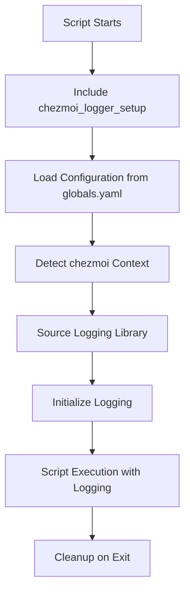

# Unified Logging System

This repository implements a sophisticated unified logging system that provides consistent, structured logging across all chezmoi scripts with deep integration into chezmoi's built-in features.

## Architecture Overview

The logging system consists of three main components:

1. **Logging Configuration** (`.chezmoidata/globals.yaml`)
2. **Logging Library** (`.chezmoitemplates/chezmoi_logger.sh`)
3. **Setup Template** (`.chezmoitemplates/chezmoi_logger_setup`)

### System Flow



## Core Features

### **1. Deep chezmoi Integration**

The logging system respects all chezmoi command-line flags:

- **`--verbose`**: Automatically sets log level to DEBUG
- **`--dry-run`**: Shows what would be done without executing
- **`--color`**: Respects color preferences and `NO_COLOR` environment variable
- **`--interactive`**: Provides interactive error handling
- **`--keep-going`**: Continues execution after errors when possible

### **2. Structured Log Levels**

```bash
log_debug "Detailed debugging information"    # [DEBUG] 🔍
log_info "General information"                # [INFO] ℹ
log_warn "Warning messages"                   # [WARN] ⚠
log_error "Error messages"                    # [ERROR] ✗
log_success "Success messages"                # [SUCCESS] ✅
log_step "Process step indicators"            # [STEP] 📋
log_check "Verification messages"             # [OK] ✓
```

### **3. Context-Aware Logging**

Each log entry includes:
- **Timestamp**: `[2025-01-15 18:30:45]`
- **Log Level**: `[INFO]`
- **Script Name**: `[install_packages]`
- **Destination**: `[work]`
- **Execution Phase**: `[before]`

Example output:
```
[2025-01-15 18:30:45] [INFO] [install_packages] [work] [before] ℹ Installing fonts category
```

### **4. Advanced Logging Functions**

#### Progress Logging
```bash
log_progress 3 10 "Installing package group"
# Output: [3/10] Installing package group
```

#### Dry-Run Aware Logging
```bash
log_dry_run "install" "zsh and terminal packages"
# Dry-run: [DRY-RUN] Would install: zsh and terminal packages
# Normal: install: zsh and terminal packages
```

#### Interactive Error Handling
```bash
handle_error "Package installation failed" 1
# Shows error and prompts user in interactive mode
# Respects --keep-going flag
```

## Configuration

### **Global Configuration** (`.chezmoidata/globals.yaml`)

```yaml
logging:
  # Basic settings
  level: "INFO"                    # DEBUG, INFO, WARN, ERROR
  colors: true                     # Enable colored output
  
  # chezmoi integration
  respect_verbose: true            # Use DEBUG level with --verbose
  respect_dry_run: true            # Show dry-run messages
  respect_color: true              # Respect --color flag
  respect_interactive: true        # Enable interactive prompts
  
  # Log destinations
  destinations:
    console: true                  # Log to console
    file: true                     # Log to file
    chezmoi_state: true           # Store in chezmoi state
  
  # File management
  log_dir: "HOME/.local/state/chezmoi/logs"
  max_log_files: 10               # Keep last 10 log files
  use_chezmoi_cache: true         # Use chezmoi's cache directory
  
  # Format options
  format:
    timestamp: true               # Include timestamps
    script_name: true            # Include script name
    destination: true            # Include destination context
```

## Usage in Scripts

### **Basic Script Template**

```bash
#!/bin/sh

# Script: script_name.sh.tmpl
# Purpose: Brief description
# Requirements: Linux

{{- template "chezmoi_logger_setup" . }}

{{ if eq .osId "linux-arch" }}

log_step "Starting script execution"

# Your script logic here
if some_operation; then
    log_success "Operation completed successfully"
else
    handle_error "Operation failed" 1
fi

log_success "Script completed"

{{ else }}
    log_error "Unsupported OS: {{ .osId }}"
    exit 1
{{ end }}
```

### **Package Installation Example**

```bash
# Define packages
PACKAGES="package1 package2 package3"

log_info "Installing packages: $PACKAGES"
log_dry_run "install" "$PACKAGES via pacman"

if [ "${CHEZMOI_DRY_RUN:-false}" != "true" ]; then
    if pacman -S --noconfirm $PACKAGES; then
        log_success "Successfully installed packages"
    else
        handle_error "Failed to install packages" 1
    fi
fi
```

### **Progress Tracking Example**

```bash
TOTAL_STEPS=5
CURRENT_STEP=0

for category in fonts terminal_utils development_tools; do
    CURRENT_STEP=$((CURRENT_STEP + 1))
    log_progress $CURRENT_STEP $TOTAL_STEPS "Processing $category"
    
    # Process category
    process_category "$category"
done
```

## Log File Management

### **Directory Structure**

```
~/.local/state/chezmoi/logs/
├── chezmoi-setup.log              # Main log file
├── chezmoi-setup-2025-01-15.log   # Daily rotation
├── chezmoi-setup-2025-01-14.log   # Previous days
└── rotate_logs.sh                 # Log rotation script
```

### **Log Rotation**

Automatic log rotation is set up during system initialization:

```bash
# Manual log rotation
~/.local/state/chezmoi/logs/rotate_logs.sh ~/.local/state/chezmoi/logs 10
```

## Environment Variables

The logging system uses these environment variables:

### **chezmoi Context Variables**
- `CHEZMOI_SOURCE_DIR`: Source directory path
- `CHEZMOI_DEST_DIR`: Destination directory path
- `CHEZMOI_CACHE_DIR`: Cache directory path
- `CHEZMOI_DESTINATION`: Current destination (work/leisure/test)

### **chezmoi Execution Flags**
- `CHEZMOI_VERBOSE`: Verbose mode enabled
- `CHEZMOI_DRY_RUN`: Dry-run mode enabled
- `CHEZMOI_INTERACTIVE`: Interactive mode enabled
- `CHEZMOI_KEEP_GOING`: Keep-going mode enabled
- `CHEZMOI_PROGRESS`: Progress display setting

### **Logging Control Variables**
- `CURRENT_LOG_LEVEL`: Current log level
- `USE_COLORS`: Color output enabled
- `LOG_TO_CONSOLE`: Console logging enabled
- `LOG_TO_FILE`: File logging enabled
- `LOG_DIR`: Log directory path
- `LOG_FILE`: Main log file path

## Debugging and Troubleshooting

### **Enable Debug Logging**

```bash
# Method 1: Use chezmoi verbose flag
chezmoi apply --verbose

# Method 2: Set environment variable
export VERBOSE=true
chezmoi apply

# Method 3: Modify configuration
# Set logging.level: "DEBUG" in globals.yaml
```

### **View Log Files**

```bash
# View main log
tail -f ~/.local/state/chezmoi/logs/chezmoi-setup.log

# View specific date
cat ~/.local/state/chezmoi/logs/chezmoi-setup-2025-01-15.log

# Search for errors
grep "ERROR" ~/.local/state/chezmoi/logs/chezmoi-setup.log
```

### **Test Logging System**

```bash
# Test with dry-run
chezmoi apply --dry-run

# Test with verbose
chezmoi apply --verbose --dry-run

# Test specific script
chezmoi execute-template < .chezmoiscripts/script_name.sh.tmpl
```

## Best Practices

### **MUST** Follow These Guidelines

1. ✅ **Always include the logger setup** at the top of scripts
2. ✅ **Use appropriate log levels** for different message types
3. ✅ **Include context in log messages** - what, why, and where
4. ✅ **Use dry-run aware logging** for operations that modify the system
5. ✅ **Handle errors gracefully** with `handle_error` function

### **SHOULD** Consider These Practices

1. ✅ **Log the start and end** of major operations
2. ✅ **Use progress logging** for long-running operations
3. ✅ **Include package names and paths** in relevant messages
4. ✅ **Log configuration decisions** and their reasoning
5. ✅ **Use structured messages** that are easy to parse

### **NEVER** Do These Things

1. ❌ **Never log sensitive information** (passwords, keys, tokens)
2. ❌ **Never ignore the dry-run flag** in destructive operations
3. ❌ **Never use echo instead of log functions** in new scripts
4. ❌ **Never log at DEBUG level for normal operations**
5. ❌ **Never assume logging is available** without including the setup

## Integration with Existing Scripts

### **Migration Strategy**

1. **Add logger setup** to the top of existing scripts
2. **Replace echo statements** with appropriate log functions
3. **Add dry-run support** for destructive operations
4. **Include error handling** with `handle_error`
5. **Test thoroughly** with different chezmoi flags

### **Example Migration**

```bash
# Before
echo "Installing packages..."
pacman -S package1 package2
echo "✓ Packages installed"

# After
log_info "Installing packages: package1 package2"
log_dry_run "install" "package1 package2 via pacman"

if [ "${CHEZMOI_DRY_RUN:-false}" != "true" ]; then
    if pacman -S --noconfirm package1 package2; then
        log_success "Successfully installed packages"
    else
        handle_error "Failed to install packages" 1
    fi
fi
```

## Performance Considerations

### **Efficient Logging**

- Log file I/O is minimized through buffering
- Color codes are stripped from file output
- Debug messages are filtered at the source
- Log rotation prevents disk space issues

### **Resource Usage**

- Minimal CPU overhead for log formatting
- Memory usage scales with log message frequency
- Disk usage controlled by rotation settings
- Network impact: none (all logging is local)

## Verification Checklist

Before modifying logging-related files:

<thinking>
1. Does this change affect the logging API?
2. Are all log levels properly handled?
3. Does this work with all chezmoi flags?
4. Have I tested dry-run mode?
5. Are colors properly handled?
6. Does this maintain backward compatibility?
</thinking>

### Critical Questions
1. 🔍 **Does this change break existing scripts?**
2. 🔍 **Are all chezmoi integration features working?**
3. 🔍 **Is the log output readable and useful?**
4. 🔍 **Does dry-run mode work correctly?**

---

**REMEMBER**: The unified logging system is designed to provide consistent, informative, and chezmoi-native logging across all scripts. Always test changes with different chezmoi flags and log levels to ensure proper functionality.
