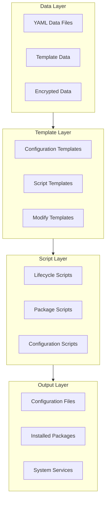
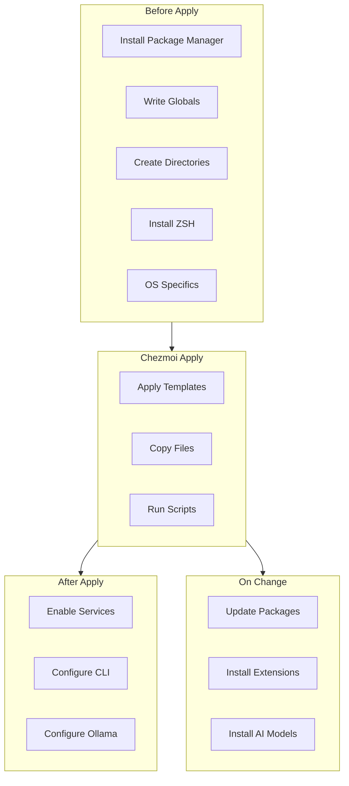
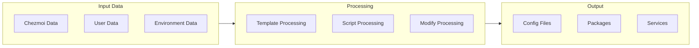

# System Patterns: Chezmoi Dotfiles Management System

## System Architecture

The dotfiles management system follows a layered architecture with clear separation of concerns:



### 1. Data Layer

The data layer contains all the configuration data that drives the system:

- **YAML Data Files** (`.chezmoidata/*.yaml`): Structured configuration data
- **Template Data** (`.chezmoi.yaml.tmpl`): User-specific variables and settings
- **Encrypted Data** (`*.age` files): Sensitive information secured with age encryption

### 2. Template Layer

The template layer transforms data into executable scripts and configurations:

- **Configuration Templates** (`*.tmpl` files): Go templates for generating configuration files
- **Script Templates** (`.chezmoiscripts/*.sh.tmpl`): Templated shell scripts
- **Modify Templates** (`modify_*.tmpl`): Special templates for handling mixed state/settings files

### 3. Script Layer

The script layer executes the actual system changes:

- **Lifecycle Scripts**: Scripts that run at specific points in the chezmoi lifecycle
- **Package Scripts**: Scripts for installing and updating packages
- **Configuration Scripts**: Scripts for configuring system components

### 4. Output Layer

The output layer represents the final state of the system:

- **Configuration Files**: Generated configuration files in their target locations
- **Installed Packages**: Software packages installed on the system
- **System Services**: Configured and enabled system services

## Key Technical Decisions

### 1. Chezmoi as Core Engine

**Decision**: Use chezmoi as the core dotfiles management engine.

**Rationale**:
- Built-in template support with Go templates
- Native encryption integration
- Cross-platform compatibility
- Robust conflict resolution
- Active development and community

### 2. Age Encryption for Sensitive Data

**Decision**: Use age encryption for securing sensitive data.

**Rationale**:
- Modern, secure encryption algorithm
- Simple key management
- Integration with chezmoi
- Designed for file encryption
- Better than alternatives like GPG for this use case

### 3. Multi-Strategy Package Management

**Decision**: Implement a sophisticated multi-strategy approach to package management.

**Rationale**:
- Different packages have different optimal installation methods
- Balances stability (official repos) with availability (AUR/PPAs)
- Allows for fallbacks when primary methods fail
- Provides consistent behavior across distributions

### 4. Distribution-Specific Adaptation

**Decision**: Adapt scripts for cross-distribution compatibility rather than creating separate configurations.

**Rationale**:
- Maintains a single source of truth
- Reduces duplication and potential inconsistencies
- Leverages conditional logic to handle differences
- Easier to maintain and extend

### 5. Strict File Naming Conventions

**Decision**: Implement strict file naming conventions for different file types.

**Rationale**:
- Clearly communicates file purpose and handling
- Enables automated processing based on filename patterns
- Consistent with chezmoi conventions
- Improves maintainability

## Design Patterns

### 1. Strategy Pattern

Used in package management to select different installation methods based on package type and availability.

**Implementation**:
```yaml
strategies:
  default_strategy: [pacman, yay_bin, yay_source]
  _install_binary: &_install_binary [pacman, yay_bin]
  _install_from_source: &_install_from_source [pacman, yay_bin, yay_source]
```

**Usage**:
```bash
for installer in $strategy; do
    if install_with_$installer "$package"; then
        return 0
    fi
done
```

### 2. Template Method Pattern

Used in script structure to define the skeleton of operations while allowing specific steps to vary by distribution.

**Implementation**:
```bash
{{ if eq .chezmoi.os "linux" }}
    # Common Linux implementation
    
    {{ if eq .chezmoi.osRelease.id "arch" }}
        # Arch-specific implementation
    {{ else if eq .chezmoi.osRelease.id "ubuntu" }}
        # Ubuntu-specific implementation
    {{ else if eq .chezmoi.osRelease.id "fedora" }}
        # Fedora-specific implementation
    {{ end }}
{{ else }}
    # Non-Linux implementation
{{ end }}
```

### 3. Factory Pattern

Used to create appropriate installation functions based on the detected distribution.

**Implementation**:
```bash
install_package() {
    local package="$1"
    
    {{ if eq .chezmoi.osRelease.id "arch" }}
        sudo pacman -S --noconfirm "$package" || yay -S --noconfirm "$package"
    {{ else if eq .chezmoi.osRelease.id "ubuntu" }}
        sudo apt-get install -y "$package"
    {{ else if eq .chezmoi.osRelease.id "fedora" }}
        sudo dnf install -y "$package"
    {{ end }}
}
```

### 4. Observer Pattern

Used in the run_onchange scripts to detect and respond to changes in configuration files.

**Implementation**:
```bash
# Hash: {{ include ".chezmoidata/packages.yaml" | sha256sum }}
```

### 5. Adapter Pattern

Used in chezmoi_modify_manager to adapt between different configuration file formats and chezmoi's management system.

**Implementation**:
```bash
#!/usr/bin/env chezmoi_modify_manager
source auto

# Adapt between INI file and chezmoi management
ignore "General" "ColorSchemeHash"
set "User" "Name" "{{ .fullname }}"
```

## Component Relationships

### Script Lifecycle Relationships



### Data Flow Relationships



## Critical Implementation Paths

### 1. Initial Setup Path

The critical path for initial system setup:

1. **Package Manager Installation**: Ensures the correct package managers are available
2. **Directory Creation**: Sets up the required directory structure
3. **Core Package Installation**: Installs essential packages
4. **Configuration Application**: Applies configuration files
5. **Service Enablement**: Enables required services

### 2. Update Path

The critical path for system updates:

1. **Change Detection**: Detects changes in configuration files
2. **Package Updates**: Updates installed packages
3. **Configuration Updates**: Updates configuration files
4. **Service Restarts**: Restarts affected services

### 3. Cross-Distribution Adaptation Path

The critical path for adapting to different distributions:

1. **Distribution Detection**: Identifies the current distribution
2. **Package Manager Selection**: Selects the appropriate package manager
3. **Package Name Mapping**: Maps generic package names to distribution-specific names
4. **Installation Method Selection**: Selects the appropriate installation method
5. **Configuration Adaptation**: Adapts configuration files to the distribution

## Design Principles

1. **Separation of Concerns**: Clear separation between data, templates, scripts, and output
2. **DRY (Don't Repeat Yourself)**: Use templates and functions to avoid duplication
3. **Fail Fast**: Validate requirements early and provide clear error messages
4. **Graceful Degradation**: Provide fallbacks when primary methods fail
5. **Idempotence**: Scripts can be run multiple times without negative effects
6. **Security by Design**: Encryption and secure practices integrated from the start
7. **Transparency**: Clear documentation and logging of all operations
