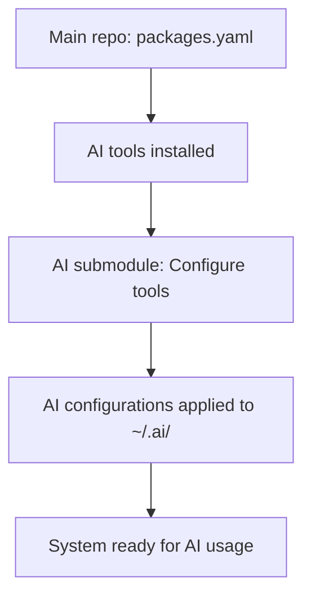

# CLAUDE.md

This file provides guidance to Claude Code (claude.ai/code) when working with code in this repository.

## Project Overview

This is a sophisticated chezmoi dotfiles repository that manages personal configuration files across systems with advanced AI assistant integration. The repository implements comprehensive templating, encryption, automated maintenance, and knowledge management systems designed for Arch Linux work environments.

**System Configuration**: This repository is configured for a comprehensive work environment with all packages, services, extensions, and AI models installed. The destination concept has been simplified to always deploy the full work configuration.

### Git Submodule Architecture

This system uses git submodules to manage AI-related configurations:

#### Primary Repository: `/home/amaury/.local/share/chezmoi`
- **Purpose**: Complete system configuration management
- **Scope**: Shell, applications, development tools, system services
- **Key Features**: Advanced templating, age encryption, chezmoi_modify_manager integration

#### AI Submodule: `external_dot_ai/`
- **Purpose**: AI assistant rules and configurations
- **Location**: `/home/amaury/.local/share/chezmoi/external_dot_ai/`
- **Target**: Files are deployed to `~/.ai/`
- **Structure**:
  - `rules/cline/` - Cline AI assistant behavioral rules → `~/.ai/rules/cline/`
  - `dot_continue.yaml.tmpl` - Continue AI extension configuration → `~/.ai/.continue.yaml`
- **Integration**: Inherits template variables from main repository

## 🚨 CRITICAL SAFETY PROTOCOLS 🚨

### **NEVER** Attempt These Operations
❌ **NEVER** decrypt encrypted files programmatically  
❌ **NEVER** read contents of `.age` files  
❌ **NEVER** access encryption keys directly  
❌ **NEVER** modify encryption configuration without explicit user guidance  
❌ **NEVER** bypass security protocols for "convenience"  

### **ALWAYS** Guide Manual Encryption Operations
```bash
# Guide user to run manually:
chezmoi decrypt path/to/encrypted_file.age    # To view
chezmoi edit path/to/encrypted_file.age       # To edit
chezmoi add --encrypt path/to/sensitive_file  # To encrypt
```

## Architecture and Structure

### Chezmoi Template System
- **Template files**: `.tmpl` extension processed with Go text/template
- **Naming conventions**:
  - `private_dot_*` → private files (e.g., `private_dot_config/` → `~/.config/`)
  - `encrypted_*` → age-encrypted files
  - `modify_*` → chezmoi_modify_manager processed files
  - `run_once_*` → lifecycle scripts run once
  - `run_onchange_*` → scripts run when content changes

### Template Variables
```go
# Built-in chezmoi variables
{{ .chezmoi.os }}              # Operating system
{{ .chezmoi.arch }}            # Architecture
{{ .chezmoi.hostname }}        # System hostname
{{ .chezmoi.username }}        # Current user
{{ .chezmoi.sourceDir }}       # Source directory path
{{ .chezmoi.homeDir }}         # Home directory path

# User-defined variables (from .chezmoi.yaml.tmpl)
{{ .fullname }}                # Full name
{{ .firstname }}               # First name only  
{{ .workEmail }}              # Work email address
{{ .personalEmail }}          # Personal email address
{{ .privateServer }}          # Private server URL
{{ .chassisType }}            # Chassis type from hostnamectl (laptop/desktop)

# Data from .chezmoidata/ files (YAML becomes nested objects)
{{ .packages.install.arch }}  # Package data
{{ .colors.oksolar.base03 }}  # Color definitions
{{ .extensions.code }}        # Extension lists
```

### Standard Template Patterns
```go
# OS Detection
{{ includeTemplate "arch_linux_check" . }}

# Logging (MUST use these instead of echo)
{{ includeTemplate "log_start" "message" }}     # 🚀 Start
{{ includeTemplate "log_step" "message" }}      # 📋 Steps  
{{ includeTemplate "log_success" "message" }}   # ✅ Success
{{ includeTemplate "log_error" "message" }}     # ❌ Errors
{{ includeTemplate "log_complete" "message" }}  # 🎉 Complete

# Advanced Template Syntax (Go text/template + Sprig functions)
{{ if eq .chezmoi.os "linux" }}                 # Conditional logic
{{ if and (eq .chezmoi.os "linux") (ne .workEmail "") }}  # Chained operators
{{ .firstname | lower }}                        # String transformations
{{ .privateServer | replace "www" "nextcloud" }} # String replacement
{{ range .extensions.code }}                    # Iteration over arrays
{{ end }}
{{ $server := .privateServer | default "localhost" }}  # Variable assignment with defaults

# Whitespace control
# Remove whitespace
{{ includeTemplate "log_info" "message" }}
{{- end -}}

# Testing templates
# Use: chezmoi execute-template < template.tmpl
# View data: chezmoi data
```

## Core System Components

### Data Files Structure (.chezmoidata/)
```
.chezmoidata/
├── packages.yaml      # Package management with install strategies
├── ai.yaml           # AI models configuration (ollama models)
├── extensions.yaml   # VSCode extensions list
├── colors.yaml       # Color scheme definitions (oksolar)
└── globals.yaml      # Global environment variables (XDG paths)
```

**Key Concepts:**
- **Install Strategies**: `_install_binary`, `_install_from_source` with fallback chains
- **Package Categories**: fonts, terminal_essentials, development_tools, ai_tools, etc.
- **Strategy Chains**: `[pacman, yay_bin, yay_source]` for robust package installation
- **Full Work Environment**: All package categories installed for comprehensive development setup

### Lifecycle Scripts (.chezmoiscripts/)
```
.chezmoiscripts/
├── run_once_before_001_install_package_manager.sh.tmpl
├── run_once_before_002_write_globals.sh.tmpl
├── run_once_before_003_create_necessary_directories.sh.tmpl
├── run_once_before_004_install_zsh.sh.tmpl
├── run_once_before_008_install_arch_packages.sh.tmpl
├── run_once_after_001_generate_and_config_cli.sh.tmpl
├── run_once_after_002_enable_services.sh.tmpl
├── run_once_after_003_setup_network_printer.sh.tmpl
├── run_once_after_004_enable_topgrade_timer.sh.tmpl
├── run_once_after_005_configure_ollama.sh.tmpl
├── run_onchange_after_install_ai_models.sh.tmpl
├── run_onchange_after_install_extensions.sh.tmpl
└── run_onchange_before_create_git_hooks.sh.tmpl
```

**Script Execution Order:**
1. `run_once_before_*` → Setup (package managers, directories, tools)
2. File application → chezmoi applies all configuration files
3. `run_once_after_*` → Configuration (services, final setup)
4. `run_onchange_*` → Content-driven (when data files change)

### Template System (.chezmoitemplates/)
```
.chezmoitemplates/
├── log_start          # 🚀 Script start logging
├── log_step           # 📋 Major step logging
├── log_success        # ✅ Success logging
├── log_error          # ❌ Error logging
└── log_complete       # 🎉 Completion logging
```

**Template Functions:**
- **Logging**: `{{ includeTemplate "log_start" "message" }}`
- **Error Handling**: Use standard shell error handling with `set -euo pipefail`

### Configuration Organization
- **`private_dot_config/`** - XDG config directory contents
- **`private_dot_keys/`** - Encrypted keys and secrets (🔐 NEVER access directly)
- **`private_dot_ssh/`** - SSH configuration and encrypted keys
- **`.memory-bank/`** - AI assistant knowledge base

### Development Environment
- **Languages**: Go, Python, Rust (managed via mise)
- **Tools**: Docker, VSCode, Git (delta, mergiraf), AI tools (Ollama)
- **Terminal**: Zsh + antidote, enhanced CLI tools (ripgrep, fd, fzf, etc.)
- **Theme**: Consistent Solarized (oksolar) color scheme

## Package Management System

### **MUST** Understand Installation Strategies
This repository uses sophisticated package management with fallback chains:

```yaml
strategies:
  _install_binary: &_install_binary [pacman, yay_bin]
  _install_from_source: &_install_from_source [pacman, yay_bin, yay_source]
```

**Strategy Execution:**
1. Try `pacman` (official repos)
2. Try `yay_bin` (AUR precompiled)  
3. Try `yay_source` (AUR from source)

### **System Configuration**
The system is configured for a full work environment with:

- **All package categories**: Complete development stack with tools, AI assistance, and general applications
- **All services enabled**: Docker, Snap, Bluetooth, and other work-related services
- **Extensions**: VSCode extensions always installed
- **AI models**: All AI models installed and configured

### Package Categories
- **fonts**: Programming fonts (FiraCode, Geist Mono, etc.)
- **terminal_essentials**: Core CLI tools (ripgrep, fd, bat, fzf, etc.)
- **terminal_utils**: System monitoring (btop, nvitop, fastfetch, etc.)
- **languages**: Programming languages (Go, Python, Rust)
- **development_tools**: Development software (Docker, VSCode)
- **ai_tools**: AI/ML tools (ollama, vllm)
- **general_software**: End-user apps (Firefox, Spotify, Nextcloud)
- **work_software**: Work-specific (Chromium, Slack)

### **CRITICAL** Package Installation Flow
1. **Setup Phase**: `run_once_before_*` installs package managers (yay, chaotic-aur)
2. **Package Phase**: `run_once_before_008_install_arch_packages.sh.tmpl` processes all package categories
3. **Services Phase**: `run_once_after_002_enable_services.sh.tmpl` enables Docker, Snap, and Bluetooth
4. **AI Configuration Phase**: `run_once_after_005_configure_ollama.sh.tmpl` configures Ollama service
5. **Extension Phase**: `run_onchange_after_install_extensions.sh.tmpl` installs VSCode extensions
6. **AI Model Phase**: `run_onchange_after_install_ai_models.sh.tmpl` pulls Ollama models

## Common Commands

### Chezmoi Management
```bash
# MANDATORY: Always run before changes
chezmoi diff                    # Preview changes
chezmoi apply --dry-run        # Test without applying

# Daily operations  
chezmoi apply -v               # Apply changes (verbose)
chezmoi status                 # Check status
chezmoi edit <file>            # Edit managed files
chezmoi add <file>             # Add new files

# Merge conflict resolution
chezmoi merge <file>           # Resolve specific file
chezmoi merge-all             # Resolve all conflicts
```

### System Maintenance
```bash
# Automated updates (configured via systemd)
topgrade                       # Comprehensive system updates
systemctl --user enable topgrade.timer

# Package management
yay -Syu                      # Update Arch packages + AUR
mise install                  # Install tool versions
```

## Script Standards (MANDATORY)

### **MUST** Follow This Exact Structure
```bash
#!/bin/sh

# Script: [filename]
# Purpose: [clear description]  
# Requirements: Arch Linux, [dependencies]

{{ includeTemplate "log_start" "[description]" }}

# Set strict error handling
set -euo pipefail

# Script implementation (NO main function)
# Use log templates for ALL output

{{ includeTemplate "log_complete" "[completion message]" }}
```

### **NEVER** Use These Anti-Patterns
❌ **NEVER** wrap scripts in main functions  
❌ **NEVER** use manual echo for logging  
❌ **NEVER** add unnecessary OS detection (system assumes Arch Linux)  
❌ **NEVER** add cross-platform compatibility (focused on Arch Linux only)  

### **ALWAYS** Trust Script Execution Order
Scripts execute in order: `run_once_before_*` → file application → `run_once_after_*` → `run_onchange_*`
Trust that previous scripts succeeded (chezmoi stops if they fail).

## chezmoi_modify_manager Integration

### Understanding the Problem
**chezmoi_modify_manager** is a specialized addon for handling configuration files that contain **mixed settings and state**. Many applications (KDE, Nextcloud, PrusaSlicer) store both:
- **Settings**: User preferences that should be managed in dotfiles
- **State**: Runtime data (window positions, cache, session info) that changes frequently

**The core issue**: Traditional dotfiles management treats these as single units, causing constant churn from state changes. chezmoi_modify_manager intelligently separates concerns.

### File Patterns
- **`modify_*.tmpl`** - Processing script files
- **`*.src.ini`** - Source files with only managed settings

### How chezmoi_modify_manager Works
1. **Reads current application config** (the file with mixed settings/state)
2. **Loads managed settings** from corresponding `.src.ini` file
3. **Applies modification directives** (ignore, set, transform)
4. **Merges intelligently** - keeps managed settings, preserves runtime state
5. **Writes processed config** back to application

### Core Directives

#### `source auto`
```bash
#!/usr/bin/env chezmoi_modify_manager
source auto  # Automatically finds corresponding .src.ini file
```

#### `ignore` - Filter Out State Data
```bash
# Ignore specific keys
ignore "General" "ColorSchemeHash"           # Single key
ignore "KFileDialog Settings" "Show hidden files"

# Ignore entire sections
ignore section "DirSelect Dialog"            # Runtime window state
ignore section "Cache"                       # Temporary data

# Ignore with regex patterns
ignore regex "General" "clientVersion|lastSync"
ignore regex "Accounts" ".*version|.*journalPath|.*server.*"
```

#### `set` - Force Specific Values (Template Integration)
```bash
# Set user-specific values using chezmoi templates
set "User" "Name" "{{ .fullname }}"
set "User" "Email" "{{ .personalEmail }}"
set "Paths" "Home" "/home/{{ .firstname | lower }}"

# Template transformations
{{ $nextcloudServer := .privateServer | replace "www" "nextcloud" }}
set "Server" "URL" "{{ $nextcloudServer }}"

# Conditional settings (based on hostnamectl chassis detection)
{{ if eq .chassisType "laptop" }}
set "Power" "SuspendOnLidClose" "true"
{{ else }}
set "Power" "SuspendOnLidClose" "false"
{{ end }}
```

#### `add:remove` and `add:hide` - Smart Re-add Control
```bash
# Remove from source when re-adding (since we set them dynamically)
add:remove "User" "Name"
add:remove "Paths" "Home"
add:remove "Server" "URL"

# Hide sensitive values when adding back to source
add:hide "Accounts" "0\\password"
add:hide "Auth" "token"
```

### Advanced Features

#### Value Transformations
```bash
# Keyring password lookup
set "Database" "Password" "{{ keyring "service" "username" }}"

# Ignore list sorting order (for lists that change order frequently)
ignore_order "Plugins" "LoadOrder"
```

#### Self-Updater Support
```bash
# Enable automatic updates of chezmoi_modify_manager
self_update enable

# Check for updates but don't auto-install
self_update check
```

### Best Practices for chezmoi_modify_manager

#### **MUST** Follow These Patterns
1. ✅ **Use `source auto`** - Automatically finds corresponding `.src.ini` files
2. ✅ **Ignore runtime state** - Filter out window positions, cache, temporary data
3. ✅ **Set user-specific values** - Use chezmoi templates for personalization
4. ✅ **Remove dynamic values from source** - Use `add:remove` for template-set values
5. ✅ **Hide sensitive data** - Use `add:hide` for passwords and tokens

#### **SHOULD** Consider These Practices
1. ✅ **Group related ignores** - Organize ignore statements by functionality
2. ✅ **Use regex for patterns** - Efficiently ignore multiple similar keys
3. ✅ **Document complex logic** - Add comments explaining why specific ignores are needed
4. ✅ **Test modifications** - Use `chezmoi cat` to preview results before applying
5. ✅ **Handle edge cases** - Consider what happens when applications update their config format

#### **NEVER** Do These Things
1. ❌ **Never ignore critical settings** - Only ignore state data, not user preferences
2. ❌ **Never set hardcoded values** - Use template variables for user-specific data
3. ❌ **Never modify without testing** - Always validate with `chezmoi cat` first
4. ❌ **Never commit sensitive data** - Use `add:hide` for passwords and tokens
5. ❌ **Never assume config structure** - Test with actual application config files

## AI Assistant Integration

### Memory Bank System
This repository implements a comprehensive AI knowledge management system:

#### Core Files (Versioned)
- **`project_brief.md`** - Foundation document, project scope
- **`product_context.md`** - Why project exists, problems solved
- **`system_patterns.md`** - Architecture, design patterns
- **`tech_context.md`** - Technologies, development setup

#### Machine-Specific Files (Not Versioned)
- **`active_context.md`** - Current work focus, recent changes
- **`progress.md`** - What works, what's left to build
- **`raw_reflection_log.md`** - Detailed task reflections
- **`current_projects/`** - Detailed project documentation

### Behavioral Rules
1. **Continuous Improvement Protocol** - MUST reflect on complex tasks
2. **Context Window Management** - Monitor 50% usage threshold
3. **Knowledge Capture** - Document learnings in memory bank
4. **Task Handoff** - Use structured handoff process when needed

## Quality Standards (MANDATORY)

### **CRITICAL** Pre-Change Validation
```bash
# 1. MANDATORY: Check current state
chezmoi diff

# 2. MANDATORY: Check for merge conflicts  
chezmoi status

# 3. MANDATORY: Dry-run validation
chezmoi apply --dry-run

# 4. MANDATORY: Template syntax validation
chezmoi execute-template < template_file.tmpl

# 5. MANDATORY: Script syntax validation
bash -n script_file.sh.tmpl

# 6. MANDATORY: chezmoi_modify_manager validation (if applicable)
chezmoi_modify_manager --help-syntax                 # Check syntax reference
chezmoi execute-template < modify_script.tmpl        # Test template processing
chezmoi cat path/to/target/file                      # Preview merged result
```

### **NEVER** Skip These Steps
❌ **NEVER** run `chezmoi apply` without first running `chezmoi diff`  
❌ **NEVER** modify templates without syntax validation  
❌ **NEVER** change scripts without testing logic  
❌ **NEVER** modify chezmoi_modify_manager scripts without validating syntax first  
❌ **NEVER** assume chezmoi_modify_manager syntax without checking documentation  

### Error Handling Standards
```bash
# Script error handling
set -euo pipefail

# Template error handling
{{ if not .firstname }}
{{   fail "firstname variable is required" }}
{{ end }}

# Use safe defaults
{{ $server := .privateServer | default "localhost" }}
```

## Security and Encryption

### Encrypted File Recognition
- Files ending in `.age`
- Files in `private_dot_keys/` directory  
- Files with `encrypted_` prefix
- SSH private keys in `private_dot_ssh/`

### **ALWAYS** Guide Manual Operations
```
🔐 ENCRYPTED FILE DETECTED: [filename]

This file contains sensitive data encrypted with age encryption.

MANUAL ACTION REQUIRED:
1. To view: `chezmoi decrypt [filename]`
2. To edit: `chezmoi edit [filename]`  
3. To apply changes: `chezmoi apply`

I cannot access encrypted content for security reasons.
Please decrypt manually and provide the information needed.
```

## Feature Development Guide

### **MUST** Follow This Development Workflow

#### Phase 1: Planning and Design
1. **Understand the feature requirements**
   - What problem does this solve?
   - What dependencies are required?
   - Does this need cross-platform support?

2. **Choose the right approach**
   - **New package**: Add to `packages.yaml` and appropriate category
   - **New script**: Create lifecycle script with proper naming
   - **Configuration change**: Modify existing templates or create new ones
   - **New template**: Add to `.chezmoitemplates/` if reusable

#### Phase 2: Implementation Strategy

##### Adding New Packages
```yaml
# In .chezmoidata/packages.yaml
new_category:
  strategy: *_install_from_source  # or *_install_binary
  list:
    - package-name
    - another-package
```

The system automatically includes all package categories in the work environment configuration.

##### Creating New Scripts
**Naming Convention**: `run_[frequency]_[timing]_[order]_[description].sh.tmpl`
- `frequency`: `once` or `onchange`
- `timing`: `before` or `after`
- `order`: 3-digit number for execution sequence
- `description`: Clear purpose description

**Template Structure**:
```bash
#!/bin/sh

# Script: run_once_after_010_setup_new_feature.sh.tmpl
# Purpose: Configure new feature after package installation
# Requirements: Arch Linux, specific-package

{{ includeTemplate "arch_linux_check" . }}

{{ includeTemplate "log_start" "Setting up new feature..." }}

# Set strict error handling
set -euo pipefail

# Feature implementation
{{ includeTemplate "log_step" "Configuring feature..." }}

# Implementation code here

{{ includeTemplate "log_complete" "New feature setup completed" }}
```

##### Adding Configuration Files
1. **Simple config**: Add to `private_dot_config/` with `.tmpl` extension
2. **Mixed state/settings**: Use `chezmoi_modify_manager` pattern
3. **Sensitive data**: Encrypt with age (guide user to manual encryption)

#### Phase 3: Testing and Validation

##### **MANDATORY** Testing Sequence
```bash
# 1. Template syntax validation
chezmoi execute-template < new_template.tmpl
chezmoi execute-template --init < new_template.tmpl  # Test with init data

# 2. Script syntax validation  
bash -n new_script.sh.tmpl

# 3. Data validation  
yamllint .chezmoidata/packages.yaml
yamllint .chezmoidata/destinations.yaml

# 4. Template data inspection
chezmoi data                                    # View all available data
chezmoi data --format yaml                      # YAML format
chezmoi execute-template '{{ .chezmoi.os }}'    # Test specific variables

# 5. Preview changes
chezmoi diff

# 6. Dry run test
chezmoi apply --dry-run

# 7. Incremental testing
chezmoi apply path/to/specific/file

# 8. chezmoi_modify_manager testing (if applicable)
# Note: chezmoi_modify_manager does not support --dry-run flag
# Instead, use these validation approaches:
chezmoi_modify_manager --help-syntax                 # Check syntax documentation
chezmoi execute-template < modify_script.tmpl        # Test template processing  
chezmoi cat path/to/target/file                      # Preview merged result

# 9. Full validation
chezmoi status
chezmoi verify
```

##### **SHOULD** Test on Different Scenarios
- Test with different template variables
- Test error conditions (missing dependencies, failed installations)
- Test script execution order dependencies

#### Phase 4: Integration and Documentation

##### **MUST** Update Documentation
1. **Update CLAUDE.md** if the feature changes core workflows
2. **Add inline comments** explaining complex logic
3. **Document new template variables** if introduced
4. **Update package category descriptions** if new categories added

##### **SHOULD** Consider Integration Points
- How does this interact with existing scripts?
- Are there new dependencies to document?
- Does this affect the Memory Bank or AI assistant rules?
- Are there security implications?

### Common Feature Development Patterns

#### Pattern 1: Adding Development Tools
```yaml
# 1. Add to packages.yaml
new_dev_tools:
  strategy: *_install_from_source
  list:
    - tool-name
    - related-tool

# 2. Create configuration script
# run_once_after_011_configure_new_tools.sh.tmpl
```

#### Pattern 2: Adding Desktop Applications
```yaml
# 1. Add to packages.yaml  
new_applications:
  strategy: *_install_binary
  list:
    - app-name

# 2. Update the hardcoded package list in run_once_before_008_install_arch_packages.sh.tmpl
# Add "new_applications" to the $workPackages list
```

#### Pattern 3: Adding Template-Driven Configuration
```bash
# 1. Create template file
# private_dot_config/app/config.tmpl

# 2. Use template variables
[User]
Name = {{ .fullname }}
Email = {{ .personalEmail }}
Path = /home/{{ .firstname | lower }}/app

# 3. Add OS-specific logic if needed
# Arch Linux configuration (system always assumes Arch)
```

#### Pattern 4: Adding chezmoi_modify_manager Integration
```bash
# 1. Create modify script
# private_dot_config/modify_app_config.tmpl

#!/usr/bin/env chezmoi_modify_manager
source auto

# Ignore runtime state
ignore "State" "LastUsed"
ignore section "Cache"

# Set user preferences
set "User" "Name" "{{ .fullname }}"
set "Paths" "DataDir" "/home/{{ .firstname | lower }}/.local/share/app"

# Remove from source since set dynamically
add:remove "User" "Name"
add:remove "Paths" "DataDir"
```

### Development Workflow Best Practices

#### **MUST** Follow These Practices
1. ✅ **Start with smallest change** - Test individual components before integration
2. ✅ **Use existing patterns** - Follow established conventions and structures
3. ✅ **Validate incrementally** - Test at each step, don't batch all changes
4. ✅ **Document decisions** - Explain why specific approaches were chosen
5. ✅ **Consider work environment** - Ensure feature works for comprehensive work setup

#### **SHOULD** Consider These Practices
1. ✅ **Plan for extensibility** - Design features that can be easily extended
2. ✅ **Use template variables** - Make configurations user-specific and flexible
3. ✅ **Add error handling** - Include proper error messages and fallback behavior
4. ✅ **Test edge cases** - Consider what happens when things go wrong
5. ✅ **Review existing code** - Look for similar implementations to maintain consistency

#### **NEVER** Do These Things
1. ❌ **Never skip syntax validation** - Always check templates and scripts
2. ❌ **Never bypass security protocols** - Respect encryption and safety measures
3. ❌ **Never ignore execution order** - Consider script dependencies and timing
4. ❌ **Never hardcode user-specific values** - Use template variables
5. ❌ **Never modify core templates** - Extend rather than modify existing patterns

### Feature Development Checklist

Before considering a feature complete:

<thinking>
1. Have I validated all syntax (templates, scripts, YAML)?
2. Have I tested the feature with chezmoi diff and dry-run?
3. Have I considered all relevant destination types?
4. Have I documented the feature and its integration points?
5. Have I followed the established patterns and conventions?
6. Have I tested error conditions and edge cases?
7. Have I updated relevant data files consistently?
8. Have I respected security protocols and encryption boundaries?
</thinking>

### Critical Questions for Feature Development
1. 🔍 **Does this feature follow established patterns?**
2. 🔍 **Have I tested this incrementally and thoroughly?**
3. 🔍 **Will this work across different machines with the same environment?**
4. 🔍 **Have I documented the feature and its integration points?**
5. 🔍 **Are there any security implications I need to consider?**

## Development Workflow

### Making Changes
1. **Validate syntax** - Check templates and scripts
2. **Preview changes** - `chezmoi diff`
3. **Test incrementally** - `chezmoi apply --dry-run`
4. **Apply carefully** - `chezmoi apply`
5. **Verify results** - `chezmoi status`

### Merge Conflict Resolution
1. **Detect conflicts** - `chezmoi status` (look for "M" status)
2. **Resolve targeted** - `chezmoi merge <file>` or `chezmoi merge-all`
3. **Validate results** - `chezmoi diff` and syntax checks
4. **Special case** - Encrypted files require manual workflow

## AI Submodule Integration Protocol

### **CRITICAL** Git Submodule Workflow

When working on ANY task that involves AI tools, configurations, or assistant behavior, you **MUST** follow this protocol:

#### 1. **Repository Assessment** (MANDATORY)
```bash
# Check main repo for AI-related content
ls /home/amaury/.local/share/chezmoi/.chezmoidata/ai.yaml          # AI models data
ls /home/amaury/.local/share/chezmoi/.chezmoidata/packages.yaml     # AI tool packages  
ls /home/amaury/.local/share/chezmoi/external_dot_ai/               # AI submodule
ls /home/amaury/.local/share/chezmoi/external_dot_ai/.chezmoiscripts/ # AI setup scripts
```

#### 2. **Task Classification** (MANDATORY)
- **System AI Tools** (ollama, AI packages) → Main repo modifications
- **AI Configurations** (Continue, Cline rules) → AI submodule modifications  
- **AI Setup/Installation** → AI submodule scripts
- **AI Assistant Behavior** → AI submodule only

#### 3. **Submodule Dependencies** (CRITICAL)

**Template Variable Inheritance**:
- AI submodule inherits ALL template variables from main repo
- Changes to `.chezmoi.yaml.tmpl` affect AI submodule templates
- Test AI templates when changing user variables

**Script Execution Flow**:
- Main repo scripts: `run_once_after_001` through `run_once_after_005`
- AI submodule scripts: `run_once_after_001` through `run_once_after_002` (independent numbering)
- AI scripts run as part of main repo `chezmoi apply`
- **No conflicts** because submodule is processed as part of main repo

**Package Management Flow**:


#### 4. **Validation Protocol** (MANDATORY)
When making changes that affect AI submodule:

```bash
# Main repository validation (includes submodule)
cd /home/amaury/.local/share/chezmoi
chezmoi diff                    # Shows all changes including submodule
chezmoi apply --dry-run         # Tests all changes including submodule

# Submodule-specific validation
cd /home/amaury/.local/share/chezmoi/external_dot_ai
git status                      # Check submodule git status
cd /home/amaury/.local/share/chezmoi
chezmoi execute-template < external_dot_ai/template_file.tmpl  # Test templates
```

### **Integration Scenarios and Responses**

#### Scenario: Adding New AI Tool
1. **Package Definition** → Main repo (`.chezmoidata/packages.yaml`)
2. **Installation Logic** → Main repo (`.chezmoiscripts/run_once_before_008_install_arch_packages.sh.tmpl`)
3. **Tool Configuration** → Main repo (`.chezmoiscripts/run_once_after_005_configure_ollama.sh.tmpl`)
4. **AI Assistant Rules** → AI submodule (`rules/` or `dot_continue.yaml.tmpl`)

#### Scenario: Modifying AI Assistant Rules
1. **Rule Changes** → AI submodule only (`rules/cline/`)
2. **No main repo changes** needed
3. **Files deploy to** → `~/.ai/rules/cline/`

#### Scenario: Changing User Variables
1. **Variable Definition** → Main repo (`.chezmoi.yaml.tmpl`)
2. **Template Updates** → Both main repo and AI submodule (any `.tmpl` files using the variable)
3. **Single Repository Testing** → All templates processed together

#### Scenario: AI Model Management
1. **Model List** → Main repository (`.chezmoidata/ai.yaml`)
2. **Installation Script** → Main repository (`run_onchange_after_install_ai_models.sh.tmpl`)
3. **Trigger** → Changes to ai.yaml automatically trigger installation script

### **Submodule State Management**

#### **ALWAYS** Verify Submodule States
```bash
# Check main repo and submodule status
cd /home/amaury/.local/share/chezmoi
git status                      # Shows submodule state
git submodule status            # Shows submodule commit status
chezmoi status                  # Shows all managed files including submodule

# Check submodule repository directly
cd /home/amaury/.local/share/chezmoi/external_dot_ai
git status                      # Check for uncommitted changes
git log --oneline -5            # Recent commits
```

#### **Coordinate Submodule Updates**
- **AI tool additions** → Update main repo packages, then AI submodule configs
- **Configuration changes** → AI submodule only
- **Template variable changes** → Update main repo, test affects on AI submodule
- **Submodule commits** → Commit in submodule, then update main repo reference

### AI Assistant Best Practices

#### When Working with Git Submodule System
1. **Single repository workflow** - All managed through main repo `chezmoi apply`
2. **Follow security protocols** - Respect encryption boundaries
3. **Use quality standards** - Validate before applying changes
4. **Document decisions** - Update memory bank and main CLAUDE.md file
5. **Monitor context** - Watch for 50% usage threshold per AI rules
6. **Test submodule impacts** - Always validate template and script interactions

#### Critical Integration Reminders
- **MUST** check main repo for AI-related tasks (includes submodule)
- **MUST** follow script numbering conventions (no conflicts due to submodule)
- **MUST** test template variables with submodule templates
- **MUST** coordinate package management between main repo and submodule
- **MUST** validate changes before applying (single `chezmoi apply` command)
- **MUST** respect the dependency flow: main repo → AI submodule
- **SHOULD** maintain documentation in main CLAUDE.md file
- **SHOULD** use git to track submodule changes and main repo references

## Emergency Procedures

### If Something Goes Wrong
```bash
# Immediate response
git checkout HEAD~1
chezmoi apply

# Assessment
chezmoi diff
chezmoi status  

# Recovery
chezmoi apply specific/file
chezmoi verify
```

### If Merge Conflicts Occur
```bash
# Detection
chezmoi status

# Resolution
chezmoi merge <file>        # Targeted
chezmoi merge-all          # All conflicts

# Validation
chezmoi diff
chezmoi status
```

---

**REMEMBER**: This is a sophisticated system with multiple safety layers. Always prioritize security, validation, and documentation. When in doubt, guide the user through manual processes rather than attempting automated solutions.