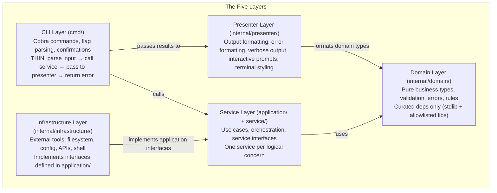

# DDD-Lite Architecture for Go CLIs

A pragmatic subset of Domain-Driven Design adapted for command-line tools. Uses
tactical DDD patterns (domain types with behavior, aggregate roots, layered
architecture, specification pattern) without strategic overhead (bounded contexts,
event storming, CQRS).

## The Five Layers



**The dependency rule**: each layer depends only on the layers below it. Domain
depends on nothing external. Infrastructure implements interfaces from `application/`.
Presenter depends on domain types for formatting but never calls services directly.

## CLI-Specific Adaptations

| Web Service Concept | CLI Equivalent                                |
| ------------------- | --------------------------------------------- |
| HTTP/gRPC handler   | Cobra command (`RunE` function)               |
| Request DTO         | Flags + args → domain request struct          |
| Response DTO        | Domain result → presenter → terminal          |
| Middleware          | Cobra `PersistentPreRunE` / hooks             |
| HTTP status codes   | Exit codes 0–6                                |
| Structured logging  | `slog` to stderr, controlled by `MYAPP_DEBUG` |
| Verbose output      | User-facing progress, controlled by `-v` flag |
| View layer          | Presenter (formatting, styling, prompts)      |

## Layer Responsibilities

### CLI Layer (`cmd/`)

- Parse flags and arguments into domain request types
- Call application services
- Pass results to the presenter layer for formatting
- Handle interactive confirmations when needed (delegate prompts to presenter)
- Return errors (error handler maps to exit codes)

**Must NOT contain**: business logic, direct infrastructure calls, validation
beyond flag parsing, output formatting logic, terminal styling.

```go
func executeCreate(cmd *cobra.Command, args []string, cfg *CommandConfig) error {
    req := &domain.CreateRequest{Name: args[0], Source: flagSource}
    result, err := cfg.Services.Creator.Create(cmd.Context(), req)
    if err != nil {
        return err
    }
    cfg.Presenter.FormatCreateResult(cmd.OutOrStdout(), result)
    return nil
}
```

### Presenter Layer (`presenter/`)

All terminal output concerns. Translates domain results into user-facing output.

- Output formatting (table, JSON, plain) based on `--output` flag
- Error formatting (user-friendly messages with suggestions)
- Verbose output (progress, diagnostic messages)
- Terminal styling (colors, borders, alignment)
- Interactive prompts (confirmations, selections)
- TTY detection and graceful degradation

**Must NOT contain**: business logic, service calls, infrastructure access.

See: `references/presenter.md` for patterns.

### Service Layer (`application/` + `service/`)

Two packages that together form the Service Layer. `application/` defines interface
contracts (ports); `service/` provides implementations (adapters).

**`application/`** — Interface contracts only (ports):

```go
type Creator interface {
    Create(ctx context.Context, req *domain.CreateRequest) (*domain.CreateResult, error)
}
type ItemReader interface {
    List(ctx context.Context, repo string) ([]domain.ItemInfo, error)
    Exists(ctx context.Context, repo, name string) (bool, error)
}
```

**`service/`** — Implementations that orchestrate domain rules + infrastructure:

```go
type creatorService struct {
    reader application.ItemReader
    config *domain.Config
    logger *slog.Logger
}
func (s *creatorService) Create(ctx context.Context, req *domain.CreateRequest) (*domain.CreateResult, error) {
    if err := req.Validate(); err != nil { return nil, err }
    if err := domain.CanCreate(req, s.config); err != nil { return nil, err }
    // orchestrate infrastructure calls
}
```

Services are non-interactive. They never prompt, never format output, never access
the terminal. They receive decided inputs and return results.

**When to split**: if you have <3 services, a single `service/` package with
interfaces at the top is fine. Split `application/` out when interfaces are shared
across packages or you want to enforce the boundary via linting.

**Command vs. Query discipline**: command methods (create, delete, update) return
thin result types confirming what happened. Query methods (list, get, status)
return rich domain types. This distinction informs presenter formatting — commands
get simple confirmations, queries get multi-format output.

### Domain Layer (`domain/`)

**The most important layer.** Contains:

- **Aggregates with behavior** (entities that own child entities and expose operations)
- **Value objects** (immutable, equality by value, always-valid construction)
- **Domain services** (pure business rules that span multiple types)
- **Validation** (composable pipeline, always-valid construction)
- **Error types** (standardized, aligned to exit codes, with `DomainError` interface)
- **Specifications** (composable predicates for filtering and querying)
- **Request/Result DTOs** for service boundaries
- **Configuration models** (strongly typed, behavioral)

**Curated dependency policy**: domain may depend on stdlib and allowlisted
zero-dep computational libraries (`samber/lo`, `samber/mo`). No I/O dependencies.
No libraries that touch the filesystem, network, or external processes. Enforce
via `depguard`.

See: `references/domain-modeling.md` for aggregate, value object, and domain service patterns.
See: `references/domain-modeling.md#specification-pattern` for specs.
See: `references/domain-modeling.md#validation-pipeline` for validation patterns.
See: `references/error-handling.md` for error type patterns.

### Infrastructure Layer (`infrastructure/`)

Concrete implementations of application interfaces. Organized by external dependency:

```text
infrastructure/
  git/           # External tool operations
  config/        # Config file loading (koanf)
  filesystem/    # File operations
  shell/         # External command execution
  api/           # HTTP API clients
```

**Key rules:**

- Infrastructure methods return domain types, not raw data. The mapping from
  external format to domain type happens inside the adapter.
- Infrastructure creates typed domain errors from raw external errors. This is
  the only layer that wraps external errors.
- Each sub-package implements one or more application interfaces.
- Individual adapters are synchronous. Concurrency is the caller's (service's)
  responsibility.

See: `references/configuration.md` for config loading pipeline and staging.
See: `references/concurrency.md` for parallel patterns and primitives.

## Project Structure Progression

**Start flat, extract when painful.** Don't pre-create packages for 2 types.

### Stage 1: Simple CLI (<5 commands, single concern)

```text
myapp/
  main.go           # Composition root + Run()
  cmd/
    root.go          # Command tree
    create.go        # Commands (thin)
  domain.go          # Types, errors, validation (single file)
  service.go         # Business logic
  git.go             # Infrastructure adapter
```

Manual DI in `main.go`. 2-3 error types inline. No `internal/`. Sequential only.

### Stage 2: Growing CLI (5-15 commands, multiple concerns)

```text
myapp/
  main.go
  cmd/
    root.go
    container.go       # DI container
    error_handler.go   # Error → exit code mapping
    create.go
    delete.go
    list.go
  internal/
    domain/
      types.go
      errors.go
      validation.go
    service/
      creator.go       # Interfaces + implementation together
      lister.go
    infrastructure/
      git/
      config/
```

`internal/` boundary established. Standardized error types with `DomainError`
interface. Error formatter in `cmd/` (candidate for later extraction to
`internal/presenter/`). `lipgloss` for styled output. `--output` flag for queries.

### Stage 3: Mature CLI (15+ commands, complex domain)

```text
myapp/
  main.go
  cmd/
    root.go
    container.go
    command_config.go
    create.go
    delete.go
    list.go
    ...
  internal/
    application/         # Interfaces only (ports)
      interfaces.go
    domain/              # Pure business logic
      types.go
      errors.go
      validation.go
      config.go
      rules.go           # Domain services (pure functions)
      specs.go           # Specification predicates
    presenter/           # All output concerns
      formatter.go       # Multi-format output
      error_formatter.go # Error presentation
      verbose.go         # Verbose output service
      styles.go          # Centralized lipgloss styles
      interactive.go     # Confirmations, selections
    service/             # Use case implementations
      creator.go
      lister.go
      pruner.go
    infrastructure/      # Concrete implementations of interfaces
      tool/              # External tool client
      config/            # Configuration loading
      shell/             # External command execution
      hooks/             # Hook/plugin execution
  tests/                 # E2E, integration, concurrent tests
    e2e/
    integration/
    concurrent/          # Race detector tests
    fixtures/
    golden/
      errors/
      list/
  # Unit tests live in *_test.go files alongside source code
```

Full layer separation. Presenter extracted from `cmd/` to `internal/presenter/`. Domain services in
`rules.go`. Consumer-oriented interface segregation. `errgroup` for parallel
infrastructure calls. `moq` for mock generation.

### Stage 4: Production-Grade CLI

**Trigger criteria** (promote when one or more applies):

- Users file bug reports you can't reproduce locally
- Output requires multiple format options beyond simple text
- Commands perform parallel I/O operations
- Service layer has formatting, logging, or concurrency concerns mixed with business logic
- You need shared error types across multiple CLI projects
- Build/release automation is required

Stage 4 is not about more commands — it's about operational quality.

```text
myapp/
  main.go
  cmd/
    root.go
    container.go
    command_config.go
    create.go
    delete.go
    list.go
    ...
  internal/
    application/
      interfaces.go
    domain/
      types.go
      errors.go
      validation.go
      config.go
      rules.go
      specs.go
      doc.go
    presenter/
      formatter.go
      error_formatter.go
      verbose.go
      styles.go
      interactive/       # bubbletea components
        confirm.go
        selector.go
    service/
      creator.go
      lister.go
      pruner.go
    infrastructure/
      tool/              # External tool operations
        client.go
        reader.go
        writer.go
        composite.go
        classify.go
      config/
        manager.go
        raw_types.go     # Serialization tags here, not in domain
      shell/
        executor.go
      hooks/
        runner.go
    version/
      version.go
  tests/                 # E2E, integration, concurrent tests
    e2e/
    integration/
    concurrent/
    fixtures/
    golden/
      errors/
      list/
  # Unit tests live in *_test.go files alongside source code
```

Additional Stage 4 characteristics:

- `samber/do` for DI when ServiceContainer exceeds 8+ services with conditional
  construction or lazy invocation needs
- `samber/mo` for `Option[T]` on optional config values, `Result[T]` where
  error chains are complex in service orchestration
- `conc` for fan-out patterns with typed result collection
- Infrastructure config uses raw types with serialization tags, mapped to
  tag-free domain config
- Plan/execute pattern for destructive bulk operations
- Full `slog` integration with debug/trace levels
- Shared error type module across CLI projects
- GoReleaser for release automation

See: `references/project-structure.md` for detailed guidance.

## Composition Root (main.go)

All dependency wiring happens in `main.go`. Manual constructor injection is the
default. See `references/dependency-injection.md` for DI evolution across stages.

```go
func main() {
    defer recoverPanic()

    // Two distinct observability channels:
    // - debug: structured logging (slog), controlled by MYAPP_DEBUG env / --debug flag
    // - verbose: user-facing progress output, controlled by -v flag
    debug := os.Getenv("MYAPP_DEBUG") != ""

    // Infrastructure (bottom-up)
    configManager := config.NewManager()
    cfg, err := configManager.Load()
    handleFatal(err)

    // Structured logging — developer/operator diagnostics
    logLevel := slog.LevelWarn
    if debug {
        logLevel = slog.LevelDebug
    }
    logger := slog.New(slog.NewTextHandler(os.Stderr, &slog.HandlerOptions{Level: logLevel}))
    executor := shell.NewCommandExecutor(cfg.Timeout)
    toolClient := git.NewClient(executor)

    // Services (depend on infrastructure)
    creator := service.NewCreator(toolClient, cfg, logger)
    lister := service.NewLister(toolClient, cfg, logger)

    // Presenter
    styles := presenter.NewStyles()
    formatter := presenter.NewFormatter(cfg.OutputFormat, styles)
    errFormatter := presenter.NewErrorFormatter(styles)

    // CLI (depends on services + presenter)
    container := &cmd.ServiceContainer{
        Creator: creator,
        Lister:  lister,
    }
    rootCmd := cmd.NewRootCommand(&cmd.CommandConfig{
        Config:         cfg,
        Services:       container,
        Presenter:      formatter,
        ErrorFormatter: errFormatter,
        Debug:          debug,
    })

    if err := rootCmd.Execute(); err != nil {
        errFormatter.Format(os.Stderr, err)
        os.Exit(int(cmd.GetExitCodeForError(err)))
    }
}
```

Notes:

- `Debug` is passed to commands; verbose output (`-v`) is handled per-command via
  `cmd.Flags().GetBool("verbose")` and passed to `presenter.VerboseOutput`
- `handleFatal` is a helper that exits with code 1 after formatting the error
- See `references/observability.md` for the full debug/verbose distinction

See: `references/dependency-injection.md` for patterns.

## Error Handling Strategy

Standardized error types aligned 1:1 with exit codes. Six types cover all CLI
error scenarios. Sub-classification uses `ErrorKind` fields, not additional types.

| Exit Code | Error Type        | When                               |
| --------- | ----------------- | ---------------------------------- |
| 0         | —                 | Success                            |
| 1         | `OperationError`  | Business logic or general failure  |
| 2         | `UsageError`      | Bad flags/args (usually Cobra)     |
| 3         | `ConfigError`     | Config missing, invalid, malformed |
| 4         | `ExternalError`   | External tool/API/network failure  |
| 5         | `ValidationError` | Domain input validation            |
| 6         | `NotFoundError`   | Resource doesn't exist             |

All error types implement a `DomainError` interface with `ExitCode()` and
`ErrorSuggestions()` methods. Error formatting lives in the presenter layer.

**Wrapping policy**: infrastructure wraps raw errors into typed domain errors
(single wrapping point). Services pass through or translate (change type when
meaning changes). Commands never wrap — they return the error for the handler.

See: `references/error-handling.md` for full patterns.

## Testing Strategy

| Layer       | Strategy                               | Tools                          |
| ----------- | -------------------------------------- | ------------------------------ |
| Domain      | Table-driven unit tests, no mocks      | `testing`, `testify`           |
| Service     | State-based mocks for infrastructure   | Hand-written or `moq`          |
| Presenter   | Golden file tests for output           | `testify`, golden file helpers |
| CLI         | Command execution with captured output | `cobra` test helpers           |
| Integration | Component interactions, real I/O       | `testify` suites               |
| Concurrent  | Race detector validation               | `-race` flag                   |
| E2E         | Full binary execution                  | `testscript`, Ginkgo + `gexec` |

See: `references/testing.md` for patterns.

## Key Principles

1. **Domain types have behavior, not just data.** `aggregate.CanDelete()` not `if aggregate.Status == "active"`.
2. **Always-valid construction.** Validate in constructors/factories. If it exists, it's valid.
3. **Define interfaces where consumed, not where implemented.** `application/` owns the interfaces; `infrastructure/` implements them.
4. **Start flat, extract when painful.** Don't create 10 packages for 5 types.
5. **Manual DI by default.** Explicit wiring in `main.go`. Consider `samber/do` at Stage 4 with 8+ services.
6. **Domain has curated deps only.** Stdlib + allowlisted zero-dep computational libraries. No I/O.
7. **Cobra commands are thin.** Parse → call service → pass to presenter. That's it.
8. **Errors are standardized and exit-code-aligned.** Six types, one per exit code, `ErrorKind` for sub-classification.
9. **Infrastructure returns domain types.** Mapping from external formats happens inside adapters.
10. **Services are non-interactive.** They never prompt, format, or touch the terminal.
11. **Every interactive command is scriptable.** Flags bypass all prompts. No command requires human interaction.
12. **Side effects are imperative.** CLIs are synchronous. No event buses or async dispatch.

## Common Libraries

| Concern            | Recommended             | Alternative      | Stage |
| ------------------ | ----------------------- | ---------------- | ----- |
| CLI framework      | `cobra`                 | `urfave/cli`     | 1+    |
| Shell completion   | `carapace`              | Cobra built-in   | 2+    |
| Config             | `koanf`                 | `viper`          | 1+    |
| Config format      | TOML                    | YAML             | 1+    |
| Collections        | `samber/lo`             | —                | 1+    |
| Monads/Option      | `samber/mo`             | —                | 3+    |
| DI container       | `samber/do`             | Manual wiring    | 4     |
| Terminal styling   | `lipgloss`              | `fatih/color`    | 1+    |
| Interactive TUI    | `bubbletea` + `bubbles` | —                | 4     |
| Forms/prompts      | `huh`                   | `promptui`       | 3+    |
| Markdown rendering | `glamour`               | —                | 4     |
| Structured logging | `log/slog` (stdlib)     | `zerolog`        | 2+    |
| Concurrency (few)  | `errgroup`              | —                | 3+    |
| Concurrency (many) | `sourcegraph/conc`      | —                | 4     |
| Testing            | `testify`               | `gotest.tools`   | 1+    |
| Deep comparison    | `go-cmp`                | `testify/assert` | 3+    |
| Mock generation    | `matryer/moq`           | Hand-written     | 3+    |
| BDD testing        | `ginkgo` + `gomega`     | —                | 3+    |
| CLI E2E            | `testscript`            | Ginkgo `gexec`   | 3+    |
| Linting            | `golangci-lint`         | —                | 1+    |
| Arch linting       | `depguard`              | `go-cleanarch`   | 2+    |
| Release            | `goreleaser`            | —                | 2+    |

See: `references/concurrency.md` for parallel patterns and primitives.
