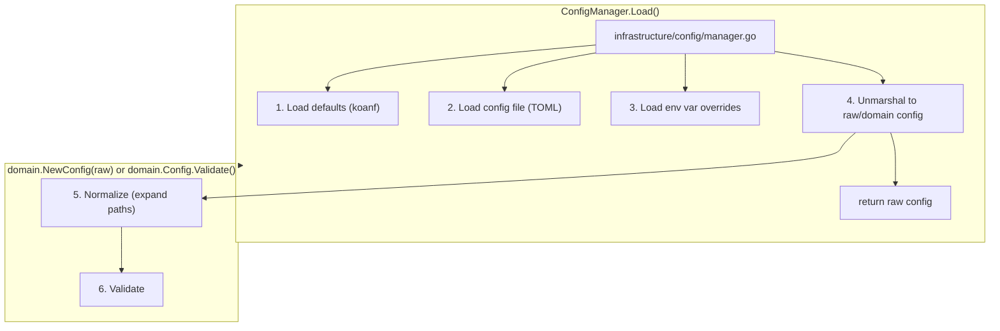

# Configuration Reference

## Loading Pipeline

Configuration follows a multi-source merge with clear layer separation:



### Stage 1-3: Direct Unmarshal

Infrastructure unmarshals directly into `domain.Config`. Serialization tags
live on the domain type. Normalization and validation happen in the domain.

```go
// infrastructure/config/manager.go
func (m *manager) Load() (*domain.Config, error) {
    k := koanf.New(".")

    // 1. Defaults
    if err := k.Load(confmap.Provider(defaultMap(), "."), nil); err != nil {
        return nil, domain.NewConfigError("", "failed to load defaults", err)
    }

    // 2. Config file (optional — missing file is not an error)
    configPath := m.findConfigFile()
    if configPath != "" {
        if err := k.Load(file.Provider(configPath), toml.Parser()); err != nil {
            return nil, domain.NewConfigError(configPath, "failed to parse config", err)
        }
    }

    // 3. Env var overrides
    if err := k.Load(env.Provider("MYAPP_", ".", envKeyReplacer), nil); err != nil {
        return nil, domain.NewConfigError("", "failed to load env vars", err)
    }

    // 4. Unmarshal
    var cfg domain.Config
    if err := k.Unmarshal("", &cfg); err != nil {
        return nil, domain.NewConfigError(configPath, "failed to unmarshal config", err)
    }

    // 5-6. Domain normalizes and validates
    if err := cfg.NormalizeAndValidate(); err != nil {
        return nil, err
    }

    return &cfg, nil
}
```

### Stage 4: Raw Config Separation

Infrastructure defines a raw config type with serialization tags. Domain
config has no tags. A mapping function bridges them.

```go
// infrastructure/config/raw_types.go
type rawConfig struct {
    ProjectsDir   string `toml:"projects_dir"   koanf:"projects_dir"`
    DefaultBranch string `toml:"default_branch"  koanf:"default_branch"`
    Timeout       int    `toml:"timeout"         koanf:"timeout"`
    // ...
}

// infrastructure/config/manager.go
func (m *manager) Load() (*domain.Config, error) {
    // ... load and unmarshal into rawConfig ...
    var raw rawConfig
    if err := k.Unmarshal("", &raw); err != nil {
        return nil, domain.NewConfigError(path, "failed to unmarshal", err)
    }
    return toDomainConfig(raw)
}

func toDomainConfig(raw rawConfig) (*domain.Config, error) {
    cfg := &domain.Config{
        ProjectsDir:   raw.ProjectsDir,
        DefaultBranch: raw.DefaultBranch,
        Timeout:       time.Duration(raw.Timeout) * time.Second,
    }
    if err := cfg.NormalizeAndValidate(); err != nil {
        return nil, err
    }
    return cfg, nil
}
```

## Config File Location (XDG)

```text
Priority 1: $XDG_CONFIG_HOME/myapp/config.toml
Priority 2: $HOME/.config/myapp/config.toml
Fallback:   config.toml in current directory (development)
```

Missing config file falls back to defaults — this is not an error.

```go
func (m *manager) findConfigFile() string {
    candidates := []string{
        filepath.Join(xdgConfigHome(), "myapp", "config.toml"),
        filepath.Join(homeDir(), ".config", "myapp", "config.toml"),
        "config.toml",
    }
    for _, path := range candidates {
        if _, err := os.Stat(path); err == nil {
            return path
        }
    }
    return "" // no config file found — use defaults
}
```

## Merge Order

Sources are loaded in priority order (last wins):

1. **Defaults** — hardcoded in `DefaultConfig()` or `defaultMap()`
2. **Config file** — TOML file at XDG path
3. **Environment variables** — `MYAPP_PROJECTS_DIR`, `MYAPP_DEFAULT_BRANCH`, etc.
4. **Flags** — CLI flags override everything (handled by Cobra, not koanf)

### Environment Variable Convention

Prefix: `MYAPP_`. Nested keys use `_` separator.

| Config Key                | Env Var                         |
| ------------------------- | ------------------------------- |
| `projects_dir`            | `MYAPP_PROJECTS_DIR`            |
| `default_branch`          | `MYAPP_DEFAULT_BRANCH`          |
| `git.cli.timeout`         | `MYAPP_GIT_CLI_TIMEOUT`         |
| `validation.strict_names` | `MYAPP_VALIDATION_STRICT_NAMES` |

```go
func envKeyReplacer(s string) string {
    return strings.Replace(strings.ToLower(
        strings.TrimPrefix(s, "MYAPP_")), "_", ".", -1)
}
```

### Flag Override Pattern

Flags take final precedence. After koanf loads, apply flag overrides:

```go
// In cmd/root.go PersistentPreRunE
if cmd.Flags().Changed("output") {
    cfg.OutputFormat, _ = cmd.Flags().GetString("output")
}
```

## Domain Config Type

The domain config has behavior, not just data. No serialization tags at Stage 4.

```go
type Config struct {
    ProjectsDir   string
    DefaultBranch string
    Timeout       time.Duration
    Validation    ValidationConfig
}

// Behavioral methods
func (c *Config) IsProtected(name string) bool {
    return lo.Contains(c.Validation.ProtectedBranches, name)
}

// Normalization + validation in one pass
func (c *Config) NormalizeAndValidate() error {
    c.ProjectsDir = expandPath(c.ProjectsDir)
    c.WorktreesDir = expandPath(c.WorktreesDir)
    return c.validate()
}

func (c *Config) validate() error {
    return configPipeline.ValidateAll(c)
}

// Default factory — returns a known-valid config
func DefaultConfig() *Config {
    return &Config{
        ProjectsDir:   filepath.Join(homeDir(), "Projects"),
        DefaultBranch: "main",
        Timeout:       30 * time.Second,
        Validation: ValidationConfig{
            ProtectedBranches: []string{"main", "master"},
        },
    }
}
```

## Path Normalization

Expand `~` and environment variables in path values. This is domain logic
(it enforces the "paths must be absolute" invariant) using stdlib functions.

```go
func expandPath(path string) string {
    if strings.HasPrefix(path, "~/") {
        path = filepath.Join(homeDir(), path[2:])
    }
    path = os.ExpandEnv(path)
    if abs, err := filepath.Abs(path); err == nil {
        path = abs
    }
    return path
}
```

## Config Immutability

Config is loaded once at startup and passed by pointer. No deep copies needed.
If no code mutates it (enforce via code review and convention), immutability
is architectural, not mechanical.

Do not implement `GetConfig()` that returns deep copies — this is defensive
programming against a problem that doesn't exist when the architecture is right.

## Config Init / Write Path

If the CLI has an `init` command that creates a config file:

```go
// infrastructure/config/manager.go
func (m *manager) Init(path string) error {
    cfg := domain.DefaultConfig()
    return m.writeToml(path, cfg)
}
```

The write path produces valid TOML from domain types. At Stage 4 with raw
types, the write path maps domain → raw → TOML.

## Error Handling

| Situation              | Error Type    | Behavior                  |
| ---------------------- | ------------- | ------------------------- |
| Config file not found  | —             | Fall back to defaults     |
| TOML parse error       | `ConfigError` | Exit 3                    |
| Validation failure     | `ConfigError` | Exit 3, show all problems |
| Env var parse error    | `ConfigError` | Exit 3                    |
| Missing required field | `ConfigError` | Exit 3, suggest fix       |

Config validation uses `ValidateAll()` (collect mode) so users see all
problems at once, not one-at-a-time.

## Testing

| Test Type   | What to Test                                     |
| ----------- | ------------------------------------------------ |
| Unit        | Default loading, validation rules, normalization |
| Integration | File parsing, XDG resolution, env var overrides  |

Test with temporary config files in `t.TempDir()`. Never rely on real user
config during tests.
