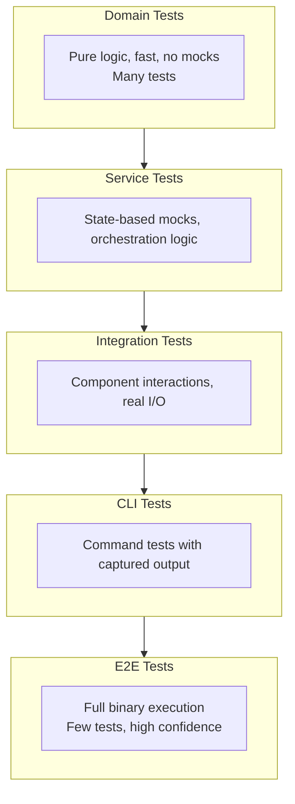

# Testing Reference

See also: `domain-modeling.md` for domain type patterns that inform how domain tests are structured.

## Testing Pyramid for Go CLIs



## Domain Tests: Table-Driven, No Mocks

Domain has curated deps only, so tests are pure and fast. Test value object
construction, aggregate behavior, domain services, validation pipelines,
and specifications.

```go
func TestNewBranchName(t *testing.T) {
    tests := []struct {
        name    string
        input   string
        wantErr bool
    }{
        {"valid name", "feature/login", false},
        {"empty string", "", true},
        {"reserved name", "HEAD", true},
        {"leading dot", ".hidden", true},
        {"trailing dash", "feature-", true},
    }

    for _, tt := range tests {
        t.Run(tt.name, func(t *testing.T) {
            _, err := NewBranchName(tt.input)
            if tt.wantErr {
                require.Error(t, err)
                var valErr *ValidationError
                require.ErrorAs(t, err, &valErr)
            } else {
                require.NoError(t, err)
            }
        })
    }
}
```

### Testing Aggregate Behavior

```go
func TestProject_CanPrune(t *testing.T) {
    tests := []struct {
        name       string
        items      []Item
        canPrune   bool
    }{
        {"multiple active items", []Item{active("a"), active("b")}, true},
        {"single active item", []Item{active("a")}, false},
        {"one active one archived", []Item{active("a"), archived("b")}, false},
    }

    for _, tt := range tests {
        t.Run(tt.name, func(t *testing.T) {
            project := NewProject(&RepositoryInfo{Name: "test"}, tt.items)
            assert.Equal(t, tt.canPrune, project.CanPrune())
        })
    }
}
```

### Testing Domain Services (Pure Functions)

```go
func TestCanDelete(t *testing.T) {
    cfg := DefaultConfig()
    cfg.Validation.ProtectedBranches = []string{"main"}

    tests := []struct {
        name    string
        project *Project
        item    *Item
        wantErr bool
    }{
        {"normal delete", projectWith(active("a"), active("b")), itemOn("a"), false},
        {"last active item", projectWith(active("a")), itemOn("a"), true},
        {"protected branch", projectWith(active("a"), active("main")), itemOn("main"), true},
    }

    for _, tt := range tests {
        t.Run(tt.name, func(t *testing.T) {
            err := CanDelete(tt.project, tt.item, cfg)
            if tt.wantErr {
                require.Error(t, err)
            } else {
                require.NoError(t, err)
            }
        })
    }
}
```

### Testing Specifications

```go
func TestItemIsStale(t *testing.T) {
    merged := []string{"feature/done", "bugfix/fixed"}
    spec := ItemIsStale(merged)

    assert.True(t, spec(&Item{branch: "feature/done", modified: false}))
    assert.False(t, spec(&Item{branch: "feature/done", modified: true}))
    assert.False(t, spec(&Item{branch: "feature/active", modified: false}))
}
```

### Testing Validation Pipelines

```go
func TestValidationPipeline_ValidateAll(t *testing.T) {
    pipeline := NewPipeline(
        func(s string) error {
            if s == "" { return NewValidationError("f", s, "empty") }
            return nil
        },
        func(s string) error {
            if len(s) > 10 { return NewValidationError("f", s, "too long") }
            return nil
        },
    )

    t.Run("all pass", func(t *testing.T) {
        err := pipeline.ValidateAll("hello")
        require.NoError(t, err)
    })

    t.Run("collects all errors", func(t *testing.T) {
        // Empty string triggers first rule; ValidateAll continues
        err := pipeline.ValidateAll("")
        require.Error(t, err)
    })
}
```

## Service Tests: State-Based Mocks

Mock infrastructure interfaces with simple structs that hold state. Test
orchestration logic — the sequence of domain rule checks and infrastructure
calls.

### Hand-Written Mocks (Stage 1-2)

```go
type mockItemReader struct {
    items    []domain.ItemInfo
    itemsErr error
}

func (m *mockItemReader) List(_ context.Context, _ string) ([]domain.ItemInfo, error) {
    return m.items, m.itemsErr
}

func (m *mockItemReader) Exists(_ context.Context, _, name string) (bool, error) {
    for _, item := range m.items {
        if item.Name == name { return true, nil }
    }
    return false, nil
}
```

### Generated Mocks with `moq` (Stage 3+)

Generate mocks from interfaces via `go generate`:

```go
//go:generate moq -out mock_reader_test.go . ItemReader

// Generated mock has function fields:
type ItemReaderMock struct {
    ListFunc   func(ctx context.Context, path string) ([]domain.ItemInfo, error)
    ExistsFunc func(ctx context.Context, path, name string) (bool, error)
}
```

Use in tests:

```go
func TestCreateService(t *testing.T) {
    mock := &ItemReaderMock{
        ExistsFunc: func(_ context.Context, _, name string) (bool, error) {
            return name == "existing", nil
        },
    }
    svc := service.NewCreator(mock, domain.DefaultConfig(), slog.Default())

    _, err := svc.Create(context.Background(), &domain.CreateRequest{
        Name: mustBranchName("feature/new"),
    })
    require.NoError(t, err)
}
```

### When to Use Which Mock Style

| Criteria                 | Hand-Written     | `moq`              |
| ------------------------ | ---------------- | ------------------ |
| Interface has <5 methods | Preferred        | Works              |
| Interface has 5+ methods | Tedious          | Preferred          |
| Need stateful behavior   | Preferred        | Add fields to mock |
| Multiple interfaces      | Tedious at scale | Preferred          |
| Stage 1-2                | Default          | —                  |
| Stage 3+                 | Small interfaces | Default            |

**Use `moq` for mock generation.** It generates behavior-based mocks (defines expected
calls). When used without expectations (filling only function fields), it acts as a
state-based mock. The `testify` package (assert/require) provides assertions — Go's
built-in `testing` is the runner. For E2E, Ginkgo is an alternative runner.

## CLI Command Tests

Test Cobra commands by constructing them with test config and capturing output.

```go
func TestCreateCommand(t *testing.T) {
    mock := &mockItemReader{items: []domain.ItemInfo{{Name: "main"}}}
    svc := service.NewCreator(mock, domain.DefaultConfig(), slog.Default())

    cfg := &cmd.CommandConfig{
        Config:         domain.DefaultConfig(),
        Services:       &cmd.ServiceContainer{Creator: svc},
        Presenter:      presenter.NewFormatter(domain.FormatPlain, presenter.NewStyles()),
        ErrorFormatter: presenter.NewErrorFormatter(presenter.NewStyles()),
    }

    root := cmd.NewRootCommand(cfg)
    buf := new(bytes.Buffer)
    root.SetOut(buf)
    root.SetErr(new(bytes.Buffer))
    root.SetArgs([]string{"create", "feature/test"})

    err := root.Execute()
    require.NoError(t, err)
    assert.Contains(t, buf.String(), "Created")
}
```

## Integration Tests

Component interactions with real I/O but no binary build. Lives in
`test/integration/` with build tags. Tests the service + infrastructure
boundary with real external tools.

```go
//go:build integration

func TestCreatorWithRealTool(t *testing.T) {
    // Set up a real temporary environment
    dir := t.TempDir()
    setupTestEnvironment(t, dir)

    executor := shell.NewCommandExecutor(30 * time.Second)
    client := tool.NewClient(executor)
    svc := service.NewCreator(client, testConfig(dir), slog.Default())

    result, err := svc.Create(context.Background(), &domain.CreateRequest{
        Name:   mustBranchName("feature/test"),
        Source: "main",
    })

    require.NoError(t, err)
    assert.Equal(t, "feature/test", result.Name)

    // Verify the external tool state
    exists, err := client.Exists(context.Background(), dir, "feature/test")
    require.NoError(t, err)
    assert.True(t, exists)
}
```

## Concurrent Tests

Race detector validation for operations that involve concurrency. Lives in
`test/concurrent/` with build tags.

```go
//go:build concurrent

func TestConcurrentListAndCreate(t *testing.T) {
    dir := t.TempDir()
    setupTestEnvironment(t, dir)

    svc := createTestService(t, dir)

    // Run list and create concurrently to detect races
    g, ctx := errgroup.WithContext(context.Background())

    g.Go(func() error {
        _, err := svc.List(ctx, &domain.ListRequest{Path: dir})
        return err
    })

    g.Go(func() error {
        _, err := svc.Create(ctx, &domain.CreateRequest{
            Name:   mustBranchName("feature/concurrent"),
            Source: "main",
        })
        return err
    })

    require.NoError(t, g.Wait())
}
```

Run with: `go test -race -tags concurrent ./test/concurrent/...`

## E2E Tests: Full Binary

Build the binary and test it as users would.

### Approach 1: testscript

Declarative `.txtar` files describing CLI interactions:

```text
# test_create.txtar

# Setup
exec tool init myrepo
cd myrepo

# Test: create resource
exec myapp create feature/test
stdout 'Created'

# Test: invalid input
! exec myapp create ''
stderr 'validation'
```

```go
//go:build e2e

func TestCLI(t *testing.T) {
    testscript.Run(t, testscript.Params{
        Dir: "testdata",
    })
}
```

### Approach 2: Ginkgo + gexec

Better for complex setup/teardown and parallel execution:

```go
//go:build e2e

var _ = Describe("create command", func() {
    It("creates a resource successfully", func() {
        cmd := exec.Command(binaryPath, "create", "feature/test")
        session, err := gexec.Start(cmd, GinkgoWriter, GinkgoWriter)
        Expect(err).NotTo(HaveOccurred())
        Eventually(session).Should(gexec.Exit(0))
        Expect(session.Out).To(gbytes.Say("Created"))
    })

    It("exits 5 for invalid input", func() {
        cmd := exec.Command(binaryPath, "create", "")
        session, err := gexec.Start(cmd, GinkgoWriter, GinkgoWriter)
        Expect(err).NotTo(HaveOccurred())
        Eventually(session).Should(gexec.Exit(5))
    })
})
```

### When to Use Which

- **testscript**: simpler, declarative, great for input/output verification
- **Ginkgo + gexec**: complex setup/teardown, parallel execution, BDD style

## Golden File Testing

Compare output against known-good reference files. Organize golden files by
concern (not flat).

```text
test/golden/
  errors/
    validation_error.txt
    external_error.txt
    not_found_error.txt
  list/
    table_output.txt
    json_output.txt
    plain_output.txt
```

```go
var update = flag.Bool("update", false, "update golden files")

func TestFormatListOutput(t *testing.T) {
    items := []domain.ItemInfo{
        {Name: "feature/login", Path: "/tmp/a"},
        {Name: "bugfix/crash", Path: "/tmp/b"},
    }

    formatter := presenter.NewFormatter(domain.FormatTable, presenter.NewStyles())
    var buf bytes.Buffer
    formatter.FormatList(&buf, items)

    golden := filepath.Join("testdata", "golden", "list", "table_output.txt")
    if *update {
        os.WriteFile(golden, buf.Bytes(), 0644)
    }

    expected, err := os.ReadFile(golden)
    require.NoError(t, err)
    assert.Equal(t, string(expected), buf.String())
}
```

## Test Helpers

At Stage 1-2, a generic test helper suffices. At Stage 3+, extract
domain-specific helpers.

```go
// test/helpers/environment.go
type TestEnvironment struct {
    Dir    string
    Config *domain.Config
}

func NewTestEnvironment(t *testing.T) *TestEnvironment {
    t.Helper()
    dir := t.TempDir()
    return &TestEnvironment{
        Dir:    dir,
        Config: testConfig(dir),
    }
}

// test/helpers/cli.go
type CLIRunner struct {
    binaryPath string
    workDir    string
}

func (r *CLIRunner) Run(args ...string) (stdout, stderr string, exitCode int) {
    cmd := exec.Command(r.binaryPath, args...)
    cmd.Dir = r.workDir
    var outBuf, errBuf bytes.Buffer
    cmd.Stdout = &outBuf
    cmd.Stderr = &errBuf
    err := cmd.Run()
    exitCode = 0
    if exitErr, ok := err.(*exec.ExitError); ok {
        exitCode = exitErr.ExitCode()
    }
    return outBuf.String(), errBuf.String(), exitCode
}
```

## Build Tags

```go
//go:build e2e           // E2E tests (slow, need binary)
//go:build integration   // Integration tests (need external tools)
//go:build concurrent    // Concurrent tests (need -race flag)
// No tag                // Unit tests (fast, no external deps)
```

Run:

```bash
go test ./...                                      # Unit tests only
go test -race -tags concurrent ./test/concurrent/  # Concurrent tests
go test -tags integration ./test/integration/...   # Integration tests
go test -tags e2e ./test/e2e/...                   # E2E tests
go test -race -tags "e2e integration concurrent" ./... # Everything
```

## Test Anti-Patterns

| Anti-Pattern                | Fix                                     |
| --------------------------- | --------------------------------------- |
| `testify/mock` expectations | State-based mocks (hand-written or moq) |
| Mocking domain types        | Domain has no I/O deps — test directly  |
| Testing private methods     | Test through public API                 |
| One giant test function     | Table-driven subtests                   |
| Shared mutable test state   | `t.TempDir()`, fresh mocks per test     |
| Testing Cobra internals     | Test your `execute*` functions directly |
| Skipping error path tests   | Test every exit code / error type       |
| Flat golden file directory  | Organize by concern                     |
| No concurrent tests         | Add race detector tests for I/O paths   |
