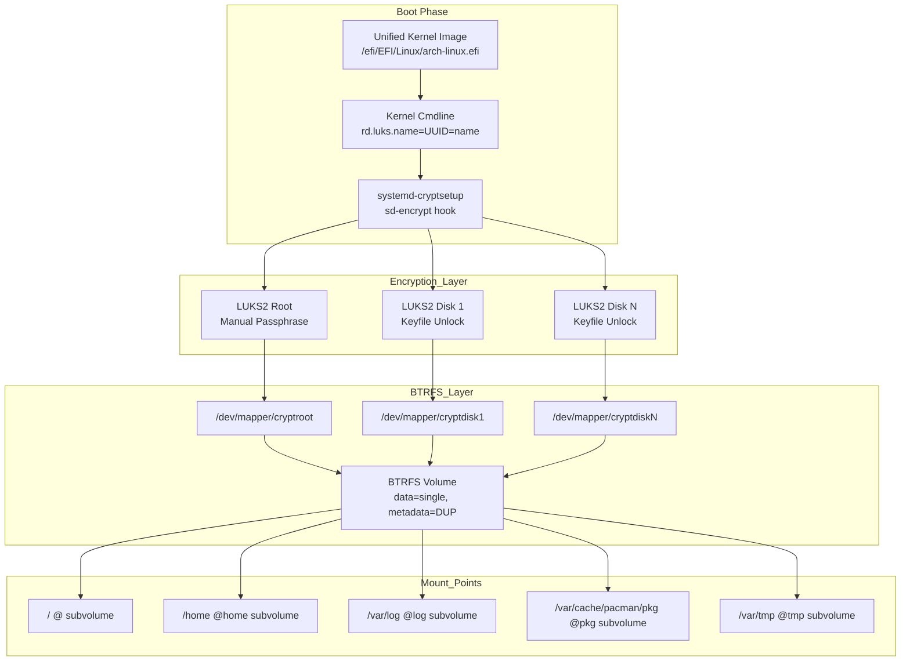
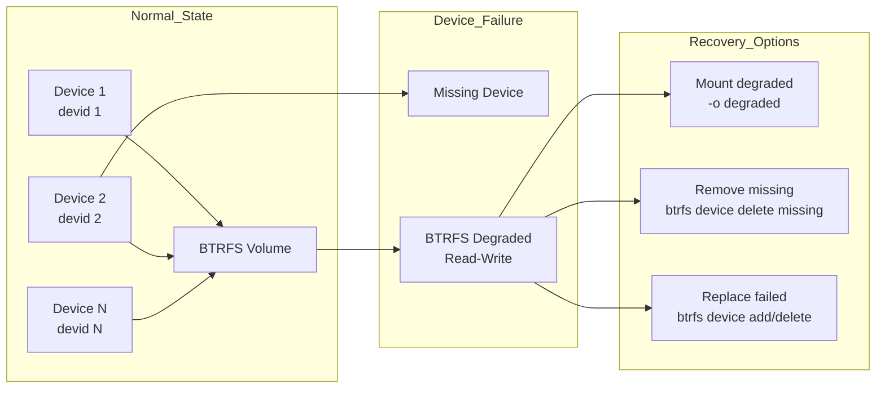

# Multi-Device Encrypted BTRFS Setup

## Overview

Configure encrypted BTRFS volume across multiple disks with single passphrase boot.

- **Root disk**: Manual passphrase unlock
- **Additional disks**: Automatic keyfile unlock
- **Filesystem**: BTRFS (data=single, metadata=DUP)
- **Boot method**: UKI with systemd sd-encrypt
- **TRIM**: Weekly via fstrim.timer

## Architecture



## Prerequisites

- Arch Linux installed with LUKS2 encrypted root
- BTRFS root filesystem
- systemd boot (UKI)
- 2+ additional physical disks available
- btrfs-progs and cryptsetup packages installed

## Phase 1: Encrypt Additional Disks

### 1.1 Identify Disks

```bash
lsblk -f
```

Note: Your root disk (encrypted) and additional disks to encrypt.

### 1.2 Wipe Additional Disks

**Replace `/dev/sdX`, `/dev/sdY`, `/dev/sdZ` with your disk paths.**

```bash
sudo wipefs -a /dev/sdX
sudo wipefs -a /dev/sdY
sudo wipefs -a /dev/sdZ
```

### 1.3 Generate Keyfiles

**N = Number of additional disks (disk1, disk2, ..., diskN)**

```bash
sudo mkdir -p /etc/luks-keys

# Generate keyfile for each additional disk
sudo dd if=/dev/urandom of=/etc/luks-keys/disk1.key bs=4096 count=1
sudo dd if=/dev/urandom of=/etc/luks-keys/disk2.key bs=4096 count=1
# Repeat for disk3.key, disk4.key, ... as needed

sudo chmod 600 /etc/luks-keys/*.key
sudo chown root:root /etc/luks-keys/*.key
```

### 1.4 Encrypt Additional Disks

**Replace UUID placeholders with actual values from `blkid /dev/sdX`.**

```bash
# Disk 1
sudo cryptsetup luksFormat /dev/sdX /etc/luks-keys/disk1.key \
  --cipher aes-xts-plain64 --key-size 512 \
  --iter-time 2000 --pbkdf argon2id

# Disk 2
sudo cryptsetup luksFormat /dev/sdY /etc/luks-keys/disk2.key \
  --cipher aes-xts-plain64 --key-size 512 \
  --iter-time 2000 --pbkdf argon2id

# Disk N (repeat as needed)
sudo cryptsetup luksFormat /dev/sdZ /etc/luks-keys/diskN.key \
  --cipher aes-xts-plain64 --key-size 512 \
  --iter-time 2000 --pbkdf argon2id
```

### 1.5 Verify Encryption

```bash
sudo cryptsetup open --test-passphrase --key-file /etc/luks-keys/disk1.key /dev/sdX
sudo cryptsetup open --test-passphrase --key-file /etc/luks-keys/disk2.key /dev/sdY
sudo cryptsetup open --test-passphrase --key-file /etc/luks-keys/diskN.key /dev/sdZ
```

**Expected**: No output (silent success).

### 1.6 Get Disk UUIDs

```bash
sudo blkid /dev/sdX
sudo blkid /dev/sdY
sudo blkid /dev/sdZ
```

**Save UUIDs** for next steps (format: `UUID="xxxxx-xxxx"`).

## Phase 2: Configure Keyfiles for Automatic Unlock

### 2.1 Prepare Keyfiles for Initramfs

**Critical**: For initramfs unlock, keyfiles must be:
1. Embedded in initramfs via mkinitcpio FILES array
2. Specified in kernel cmdline with `rd.luks.key=` parameter

The `/etc/cryptsetup-keys.d/` directory is used by systemd-cryptsetup 
in late userspace (main system), NOT in initramfs (early userspace).

### 2.2 Create cryptsetup-keys.d Directory

```bash
sudo mkdir -p /etc/cryptsetup-keys.d
```

### 2.3 Copy Keyfiles with Mapper Names

**Critical**: Filenames must match mapper names (`cryptdisk1.key` for `/dev/mapper/cryptdisk1`).

```bash
sudo cp /etc/luks-keys/disk1.key /etc/cryptsetup-keys.d/cryptdisk1.key
sudo cp /etc/luks-keys/disk2.key /etc/cryptsetup-keys.d/cryptdisk2.key
sudo cp /etc/luks-keys/diskN.key /etc/cryptsetup-keys.d/cryptdiskN.key

sudo chmod 600 /etc/cryptsetup-keys.d/*.key
sudo chown root:root /etc/cryptsetup-keys.d/*.key
```

**Important**: Do NOT copy root keyfile. Root uses manual passphrase (no keyfile for security).

### 2.4 Test Keyfiles

```bash
sudo cryptsetup open --test-passphrase \
  --key-file /etc/cryptsetup-keys.d/cryptdisk1.key /dev/sdX
sudo cryptsetup open --test-passphrase \
  --key-file /etc/cryptsetup-keys.d/cryptdisk2.key /dev/sdY
```

## Phase 3: Configure Kernel and Initramfs

### 3.1 Update mkinitcpio.conf

Edit `/etc/mkinitcpio.conf`, update FILES array:

```bash
FILES=(/etc/cryptsetup-keys.d/cryptdisk1.key
       /etc/cryptsetup-keys.d/cryptdisk2.key
       /etc/cryptsetup-keys.d/cryptdiskN.key)
```

**Verify hooks include**: `systemd sd-encrypt btrfs`

### 3.2 Get Root Disk UUID

```bash
sudo blkid /dev/root-disk
```

### 3.3 Create Kernel Cmdline

**Replace UUID placeholders** with actual values from Phase 1.6.

```bash
sudo tee /etc/cmdline.d/root.conf << 'EOF'
rd.luks.name=ROOT_UUID=cryptroot
rd.luks.key=cryptroot=/etc/cryptsetup-keys.d/cryptroot.key
root=/dev/mapper/cryptroot
rootflags=subvol=@

# Additional disks (unlock in initramfs via keyfiles)
rd.luks.name=DISK1_UUID=cryptdisk1
rd.luks.key=cryptdisk1=/etc/cryptsetup-keys.d/cryptdisk1.key
rd.luks.name=DISK2_UUID=cryptdisk2
rd.luks.key=cryptdisk2=/etc/cryptsetup-keys.d/cryptdisk2.key
rd.luks.name=DISKN_UUID=cryptdiskN
rd.luks.key=cryptdiskN=/etc/cryptsetup-keys.d/cryptdiskN.key

# Standard options
rd.luks.allow-discards
rw
rootfstype=btrfs
quiet
splash
EOF
```

**Critical**: Without `rd.luks.key=` parameters, systemd-cryptsetup will not use embedded keyfiles and automatic unlock will fail.

### 3.4 Remove Old Cmdline

```bash
sudo rm /etc/kernel/cmdline
```

### 3.5 Regenerate UKI

```bash
sudo mkinitcpio -P
```

### 3.6 Verify UKI Configuration

```bash
# Check cmdline has rd.luks.name and rd.luks.key parameters
ukify inspect /efi/EFI/Linux/arch-linux.efi | grep ".cmdline" -A3

# Verify keyfiles embedded in initramfs
sudo lsinitcpio /efi/EFI/Linux/arch-linux.efi | grep cryptsetup-keys

# Verify rd.luks.key parameters are present
grep "rd.luks.key" /etc/cmdline.d/root.conf
```

**Expected**:
- Cmdline shows all `rd.luks.name=` and `rd.luks.key=` parameters
- Keyfiles embedded: cryptdisk1.key, cryptdisk2.key, ..., cryptdiskN.key
- Root keyfile NOT embedded (security requirement)

## Phase 4: Add Disks to BTRFS

### 4.1 Reboot to Test Unlock

```bash
sudo reboot
```

### 4.2 Verify Unlock After Reboot

```bash
lsblk -f
ls -l /dev/mapper/
```

**Expected**: All devices unlocked (cryptroot, cryptdisk1, cryptdisk2, ..., cryptdiskN).

### 4.3 Add First Additional Disk

```bash
sudo btrfs device add /dev/mapper/cryptdisk1 /
```

Verify:
```bash
sudo btrfs filesystem show /
```

**Expected**: "Total devices 2"

### 4.4 Add Additional Disks

```bash
sudo btrfs device add /dev/mapper/cryptdisk2 /
sudo btrfs device add /dev/mapper/cryptdiskN /
```

Verify:
```bash
sudo btrfs filesystem show /
```

**Expected**: "Total devices N" (1 root + N-1 additional)

## Phase 5: Balance and Verify

### 5.1 Balance Data and Metadata

**Balance thresholds** (choose based on completeness/time):

| Threshold | Description | Time |
|-----------|-------------|-------|
| `-dusage=75 -musage=75` | Comprehensive redistribution | 2-6 hours |
| `-dusage=90 -musage=90` | Moderate redistribution | 1-3 hours |
| `-dusage=100 -musage=100` | Minimal redistribution | 30-60 minutes |

```bash
sudo btrfs balance start -dusage=75 -musage=75 /
```

Monitor progress:
```bash
watch -n 5 'sudo btrfs balance status /'
```

Wait until: "No balance"

### 5.2 Verify Device Usage

```bash
sudo btrfs device usage /
```

**Expected**: Data distributed across all devices.

### 5.3 Run Scrub

```bash
sudo btrfs scrub start -B -R /
```

Check results:
```bash
sudo btrfs scrub status /
```

**Expected**: "No errors found"

### 5.4 Enable fstrim (Weekly TRIM)

```bash
sudo systemctl enable --now fstrim.timer
```

Verify:
```bash
sudo systemctl status fstrim.timer
```

## Phase 6: Final Verification

### 6.1 Reboot

```bash
sudo reboot
```

### 6.2 Verify After Reboot

```bash
# All devices unlocked
lsblk -f

# BTRFS shows N devices
sudo btrfs filesystem show /

# Device usage distributed
sudo btrfs device usage /

# No BTRFS errors
sudo journalctl -b | grep -E "btrfs.*error|btrfs.*fail" | tail -10
```

## Recovery Procedures

### Recovery 1: Boot Fails - No Root Prompt

**Symptoms**: System drops to emergency shell, no passphrase prompt.

**Causes**:
- UKI cmdline corrupted
- Keyfiles not embedded in initramfs
- Root UUID mismatch

**Recovery**:

```bash
# 1. Boot to live USB

# 2. Unlock root manually
sudo cryptsetup open /dev/root-disk cryptroot

# 3. Mount root
sudo mount -o subvol=@ /dev/mapper/cryptroot /mnt

# 4. Chroot
arch-chroot /mnt

# 5. Verify cmdline
cat /etc/cmdline.d/root.conf

# 6. Verify keyfiles
sudo lsinitcpio /boot/initramfs-linux.img | grep cryptsetup-keys

# 7. Check mkinitcpio FILES array
grep "FILES=" /etc/mkinitcpio.conf

# 8. Regenerate UKI
sudo mkinitcpio -P

# 9. Exit chroot and reboot
exit
sudo reboot
```

### Recovery 2: Additional Disks Don't Unlock

**Symptoms**: Journal shows "Failed to activate with specified passphrase".

**Causes**:
- Keyfile path incorrect
- Keyfile broken/corrupted
- Mapper name mismatch

**Recovery**:

```bash
# 1. Test keyfile manually
sudo cryptsetup open --test-passphrase \
  --key-file /etc/cryptsetup-keys.d/cryptdisk1.key /dev/sdX

# 2. Check mapper name matches keyfile name
ls /etc/cryptsetup-keys.d/
# Should be: cryptdisk1.key for /dev/mapper/cryptdisk1

# 3. Check UUID and keyfile in cmdline
grep "rd.luks" /etc/cmdline.d/root.conf
# Should show: rd.luks.name=UUID=cryptdisk1 and rd.luks.key=cryptdisk1.key

# 4. Verify keyfile works with correct UUID
sudo blkid /dev/sdX
# Compare UUID with cmdline

# 5. Fix and regenerate UKI
sudo mkinitcpio -P
```

### Recovery 3: BTRFS Device Failure



**Symptoms**:
- BTRFS shows "MISSING" for a device
- System boots in degraded mode
- Journal shows "devid X missing"

**Option 1: Mount in Degraded Mode**

```bash
sudo mount -o degraded,subvol=@ /dev/mapper/cryptroot /mnt
```

**Option 2: Remove Missing Device**

```bash
# Mount degraded
sudo mount -o degraded,subvol=@ /dev/mapper/cryptroot /mnt

# Remove missing device
sudo btrfs device delete missing /mnt

# Verify
sudo btrfs filesystem show /mnt
# Should show "Total devices N-1"

# Remount normally
sudo umount /mnt
sudo mount -o subvol=@ /dev/mapper/cryptroot /mnt
```

**Option 3: Replace Failed Device**

```bash
# 1. Prepare new disk
sudo wipefs -a /dev/new-disk
sudo cryptsetup luksFormat /dev/new-disk /path/to/keyfile.key

# 2. Unlock new disk
sudo cryptsetup open /dev/new-disk cryptdiskX

# 3. Add new device to BTRFS
sudo btrfs device add /dev/mapper/cryptdiskX /

# 4. Remove failed device
# Find devid of failed device from `btrfs filesystem show`
sudo btrfs device delete FAILED_DEVID /

# 5. Verify replacement
sudo btrfs filesystem show /
```

**Note**: `btrfs replace` is for online replacement. For failed/missing devices, use `btrfs device add` then `btrfs device delete`.

### Recovery 4: LUKS Keyfile Lost

**Symptoms**: Cannot unlock additional disk, keyfile inaccessible.

**Prevention** (before disaster):

```bash
# Backup LUKS headers
sudo cryptsetup luksHeaderBackup /dev/sdX /root/luks-header-sdX.bin

# Backup keyfiles
sudo cp /etc/luks-keys/*.key /root/backup-keys/
sudo cp /etc/cryptsetup-keys.d/*.key /root/backup-keys/
```

**Recovery** (if keyfile lost but have header backup):

```bash
# Option 1: Restore header from backup
sudo cryptsetup luksHeaderRestore /root/luks-header-sdX.bin /dev/sdX
# Now can unlock with original passphrase

# Option 2: Re-encrypt disk (if no backup)
sudo wipefs -a /dev/sdX
sudo cryptsetup luksFormat /dev/sdX /new-keyfile.key
# Re-add to BTRFS
sudo btrfs device add /dev/mapper/cryptdiskX /
```

### Recovery 5: Balance Stuck or Failed

**Symptoms**: Balance hangs at same percentage for >1 hour.

**Causes**:
- High I/O load
- Disk errors
- Insufficient free space

**Recovery**:

```bash
# 1. Cancel balance
sudo btrfs balance cancel /

# 2. Check device errors
sudo btrfs device stats /
sudo btrfs device usage /

# 3. Check available space
sudo btrfs filesystem df /

# 4. Retry with lower threshold
sudo btrfs balance start -dusage=90 -musage=90 /

# 5. Or balance data only
sudo btrfs balance start -dusage=75 -musage=0 /
```

### Recovery 6: Scrub Errors Found

**Symptoms**: Scrub reports uncorrectable errors.

**Recovery**:

```bash
# 1. Check scrub details
sudo btrfs scrub status /

# 2. Identify problematic device
sudo btrfs device stats /
# Look for non-zero error counters

# 3. If errors on single device:
#   - Run SMART test
sudo smartctl -a /dev/sdX

#   - Check if device is failing
#   - If failing, use btrfs replace (Recovery 3)

# 4. If checksum errors (uncorrectable):
#   - Data is corrupted
#   - Restore from backup (Timeshift snapshot)

# 5. Fix csum errors (correctable):
sudo btrfs scrub start -B /  # Not -R (read-only)
# Allows scrub to attempt repairs
```

## Maintenance Schedule

### Weekly

```bash
# TRIM all SSD/NVMe devices
sudo systemctl start fstrim.service
```

### Monthly

```bash
# Run scrub for integrity check
sudo btrfs scrub start -B -R /

# Check device health
sudo btrfs device stats /
```

### Quarterly

```bash
# Check if balance needed
sudo btrfs filesystem usage /

# If devices have >80% usage difference:
sudo btrfs balance start -dusage=75 -musage=75 /
```

## Best Practices

### Balance Strategy

**Don't run full balance regularly** - causes unnecessary I/O.

**Run balance when**:
- Adding new devices
- Removing devices
- Large data deletion (>10% of filesystem)
- Device usage imbalance >20%

**Use usage thresholds** to limit rebalancing scope:
```bash
# Recommended for most cases
-dusage=75 -musage=75

# For SSDs (faster, less complete)
-dusage=90 -musage=90
```

### Disk Selection

**Use similar size disks** when possible:
- Prevents wasted space
- Better performance distribution
- Simpler capacity planning

**Mixed sizes work** but:
- Smaller disks fill first
- May need more frequent balances

### Keyfile Management

**Store keyfiles securely**:
```bash
# Only root can read
chmod 600 /etc/cryptsetup-keys.d/*.key
chown root:root /etc/cryptsetup-keys.d/*.key

# Backup to secure location
sudo cp /etc/cryptsetup-keys.d/*.key /root/secure-backup/
```

**Never include root keyfile in initramfs**:
- Root uses manual passphrase
- Prevents unauthorized access to system

**Note on keyfile locations**:
- For initramfs unlock: Keyfiles embedded in initramfs via FILES array and specified via `rd.luks.key=` in cmdline
- For late userspace unlock: Keyfiles in `/etc/cryptsetup-keys.d/` (automatic discovery by systemd-cryptsetup)
- This setup uses initramfs unlock for automatic boot

### Monitoring

**Monitor device health**:
```bash
# SMART status
sudo smartctl -H /dev/sdX

# BTRFS device errors
sudo btrfs device stats /

# BTRFS usage
sudo btrfs device usage /
```

## Troubleshooting

### Issue: Cannot Unlock Disk

**Check**:
```bash
sudo cryptsetup status cryptdiskX
ls -l /etc/cryptsetup-keys.d/cryptdiskX.key
```

**Fix**: Ensure keyfile exists, correct permissions, matches UUID in cmdline.

### Issue: BTRFS Won't Mount

**Check**:
```bash
sudo btrfs filesystem show /
sudo btrfs device usage /
```

**Fix**:
```bash
# Mount degraded if device missing
sudo mount -o degraded,subvol=@ /dev/mapper/cryptroot /
```

### Issue: Boot Takes Too Long

**Causes**: LUKS argon2id KDF, multiple disk unlock.

**Reduce argon2id time** (trade security vs speed):
```bash
# Reduce from 2000ms to 500ms
sudo cryptsetup luksFormat /dev/sdX /keyfile.key \
  --iter-time 500 --pbkdf argon2id

# Must reformat disk (backup data first!)
```

### Issue: Out of Space During Balance

**Check**:
```bash
sudo btrfs filesystem df /
df -h /
```

**Fix**:
```bash
# Delete large files or move to external storage
# Then retry balance
sudo btrfs balance start -dusage=90 -musage=90 /
```

## References

- [Arch Wiki: dm-crypt/System configuration](https://wiki.archlinux.org/title/dm-crypt/System_configuration)
- [Arch Wiki: BTRFS multiple devices](https://wiki.archlinux.org/title/Btrfs#Multiple_devices)
- [Arch Wiki: Unified kernel image](https://wiki.archlinux.org/title/Unified_kernel_image)
- [BTRFS Documentation](https://btrfs.readthedocs.io/)
- [cryptsetup manual](https://man.archlinux.org/man/cryptsetup.8)
